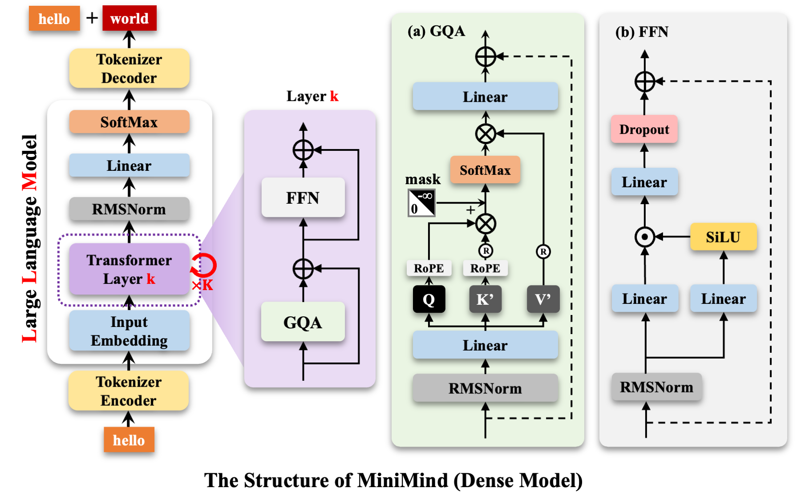

# zipformerä½åŠŸè€—æµå¼éº¦å…‹é£éŸ³é¢‘识别
```aiignore
# æµå¼éº¦å…‹é£éŸ³é¢‘识别
  
python ./python-api-examples/speech-recognition-from-microphone-with-endpoint-detection.py --tokens=./zipformer/zipformer/tokens.txt --encoder=./zipformer/zipformer/encoder-epoch-99-avg-1.onnx --decoder=./zipformer/zipformer/decoder-epoch-99-avg-1.onnx --joiner=./zipformer/zipformer/joiner-epoch-99-avg-1.onnx
```

# sence-voice麦克é£è¯­éŸ³è¯†åˆ«
```aiignore
python ./python-api-examples/vad-with-non-streaming-asr.py --silero-vad-model=./sense-voice/silero_vad.onnx --sense-voice=./sense-voice/model.int8.onnx --tokens=./sense-voice/tokens.txt --num-threads=2
```

# 关键è¯å”¤é†’

## 自定义唤醒è¯setup
```aiignore
git clone https://www.modelscope.cn/pkufool/sherpa-onnx-kws-zipformer-gigaspeech-3.3M-2024-01-01.git
pip install pypinyin
cd D:\code\minimind\zipformer-wenetspeech
sherpa-onnx-cli text2token --tokens tokens.txt --tokens-type bpe --bpe-model bpe.model keywords_raw.txt keywords.txt
cd D:\code\minimind\wenetspeech
sherpa-onnx-cli text2token --tokens tokens.txt --tokens-type ppinyin keywords_raw.txt keywords.txt
 
```

## 唤醒è¯æœåŠ¡
```aiignore
# zipformer-wenetspeech
python ./python-api-examples/keyword-spotter.py --encoder=zipformer-wenetspeech/encoder-epoch-12-avg-2-chunk-16-left-64.onnx --decoder=zipformer-wenetspeech/decoder-epoch-12-avg-2-chunk-16-left-64.onnx --joiner=zipformer-wenetspeech/joiner-epoch-12-avg-2-chunk-16-left-64.onnx --tokens=./zipformer-wenetspeech/tokens.txt --keywords-file=./zipformer-wenetspeech/test_wavs/test_keywords.txt ./zipformer-wenetspeech/test_wavs/3.wav zipformer-wenetspeech/test_wavs/4.wav ./zipformer-wenetspeech/test_wavs/5.wav
python ./python-api-examples/keyword-spotter-from-microphone.py --encoder=wenetspeech/encoder-epoch-12-avg-2-chunk-16-left-64.onnx --decoder=wenetspeech/decoder-epoch-12-avg-2-chunk-16-left-64.onnx --joiner=wenetspeech/joiner-epoch-12-avg-2-chunk-16-left-64.onnx --tokens=./wenetspeech/tokens.txt --keywords-file=./wenetspeech/keywords.txt  
```

<div align="center">


</div>

<div align="center">


[](https://github.com/jingyaogong/minimind/stargazers)
[](LICENSE)
[](https://github.com/jingyaogong/minimind/commits/master)
[](https://github.com/jingyaogong/minimind/pulls)
[](https://huggingface.co/collections/jingyaogong/minimind-66caf8d999f5c7fa64f399e5)

</div>

<div align="center">
  <h3>"大é“至简"</h3>
</div>

<div align="center">

中文 | [English](./README_en.md)

</div>

* 此开æºé¡¹ç›®æ—¨åœ¨å®Œå…¨ä»0开始，仅用3å—é’±æˆæœ¬ + 2å°æ—¶ï¼å³å¯è®­ç»ƒå‡ºä»…为25.8M的超å°è¯­è¨€æ¨¡å‹**MiniMind**。
* **MiniMind**系列æ其轻é‡ï¼Œæœ€å°ç‰ˆæœ¬ä½“积是 GPT-3 çš„ $\frac{1}{7000}$，力求åšåˆ°æœ€æ™®é€šçš„个人GPU也å¯å¿«é€Ÿè®­ç»ƒã€‚
* 项目åŒæ—¶å¼€æºäº†å¤§æ¨¡å‹çš„æ简结æ„-包å«æ‹“展共享混åˆä¸“家(MoE)ã€æ•°æ®é›†æ¸…æ´—ã€é¢„训练(Pretrain)ã€ç›‘ç£å¾®è°ƒ(SFT)ã€LoRA微调，
  ç›´æ¥å好强化学习(DPO)算法ã€æ¨¡å‹è’¸é¦ç®—法等全过程代ç ã€‚
* **MiniMind**åŒæ—¶æ‹“展了视觉多模æ€çš„VLM: [MiniMind-V](https://github.com/jingyaogong/minimind-v)。
* 项目所有核心算法代ç å‡ä»0使用PyTorchåŸç”Ÿé‡æ„ï¼ä¸ä¾èµ–第三方库æ供的抽象æ¥å£ã€‚
* è¿™ä¸ä»…是大语言模å‹çš„全阶段开æºå¤ç°ï¼Œä¹Ÿæ˜¯ä¸€ä¸ªå…¥é—¨LLM的教程。
* 希望此项目能为所有人æ供一个抛砖引ç‰çš„示例，一起感å—创造的ä¹è¶£ï¼æ¨åŠ¨æ›´å¹¿æ³›AI社区的进步ï¼

> 为防止误解，“2å°æ—¶â€ 基äºNVIDIA 3090硬件设备（å•å¡ï¼‰æµ‹è¯•ï¼Œâ€œ3å—é’±â€
> 指GPUæœåŠ¡å™¨ç§Ÿç”¨æˆæœ¬ï¼Œå…·ä½“规格详情è§ä¸‹æ–‡ã€‚

---


<div align="center">


[🔗ğŸ“æ¨ç†æ¨¡å‹](https://www.modelscope.cn/studios/gongjy/MiniMind-Reasoning) | [🔗🤖常规模å‹](https://www.modelscope.cn/studios/gongjy/MiniMind) | [🔗ğŸï¸è§†é¢‘介ç»](https://www.bilibili.com/video/BV12dHPeqE72/?share_source=copy_web&vd_source=670c2504f88726f8cf4a21ef6147c0e8)


<div align="center">
  <table>
    <tr>
      <td align="center">
        <a href="https://huggingface.co/collections/jingyaogong/minimind-66caf8d999f5c7fa64f399e5" style="text-decoration: none;">
          
        </a>
      </td>
      <td align="center">
        <a href="https://www.modelscope.cn/profile/gongjy" style="text-decoration: none;">
          
        </a>
      </td>
    </tr>
  </table>
</div>


</div>

# 📌 Introduction

大语言模å‹ï¼ˆLarge Language Model, LLM）的出ç°å¼•å‘了全世界对AI的空å‰å…³æ³¨ã€‚
无论是ChatGPTã€DeepSeek还是Qwen，都以其惊艳的效æœä»¤äººå¹ä¸ºè§‚止。
然而，动辄数百亿å‚æ•°çš„åºå¤§è§„模，使得它们对个人设备而言ä¸ä»…难以训练，甚至è¿éƒ¨ç½²éƒ½æ˜¾å¾—é¥ä¸å¯åŠã€‚
打开大模å‹çš„“黑盒å­â€ï¼Œæ¢ç´¢å…¶å†…部è¿ä½œæœºåˆ¶ï¼Œå¤šä¹ˆä»¤äººå¿ƒæ½®æ¾æ¹ƒï¼
é—憾的是，99%çš„æ¢ç´¢åªèƒ½æ­¢æ­¥äºä½¿ç”¨LoRA等技术对ç°æœ‰å¤§æ¨¡å‹è¿›è¡Œå°‘é‡å¾®è°ƒï¼Œå­¦ä¹ ä¸€äº›æ–°æŒ‡ä»¤æˆ–任务。
这就好比教牛顿如何使用21世纪的智能手机——虽然有趣，å´å®Œå…¨å离了ç†è§£ç‰©ç†æœ¬è´¨çš„åˆè¡·ã€‚
ä¸æ­¤åŒæ—¶ï¼Œç¬¬ä¸‰æ–¹çš„大模å‹æ¡†æ¶å’Œå·¥å…·åº“，如transformers+trl，几ä¹åªæš´éœ²äº†é«˜åº¦æŠ½è±¡çš„æ¥å£ã€‚
通过短短10行代ç ï¼Œå°±èƒ½å®Œæˆâ€œåŠ è½½æ¨¡å‹+加载数æ®é›†+æ¨ç†+强化学习â€çš„å…¨æµç¨‹è®­ç»ƒã€‚
è¿™ç§é«˜æ•ˆçš„å°è£…固然便利，但也åƒä¸€æ¶é«˜é€Ÿé£èˆ¹ï¼Œå°†æˆ‘们ä¸åº•å±‚å®ç°éš”离开æ¥ï¼Œé˜»ç¢äº†æ·±å…¥æ¢ç©¶LLM核心代ç çš„机会。
然而，“用ä¹é«˜æ‹¼å‡ºä¸€æ¶é£æœºï¼Œè¿œæ¯”å在头等舱里é£è¡Œæ›´è®©äººå…´å¥‹ï¼â€ã€‚
更糟糕的是，互è”网上充斥ç€å¤§é‡ä»˜è´¹è¯¾ç¨‹å’Œè¥é”€å·ï¼Œä»¥æ¼æ´ç™¾å‡ºã€ä¸€çŸ¥åŠè§£çš„内容æ¨é”€AI教程。
正因如此，本项目åˆè¡·æ˜¯æ‹‰ä½LLM的学习门槛，让æ¯ä¸ªäººéƒ½èƒ½ä»ç†è§£æ¯ä¸€è¡Œä»£ç å¼€å§‹ï¼Œ
ä»é›¶å¼€å§‹äº²æ‰‹è®­ç»ƒä¸€ä¸ªæå°çš„语言模å‹ã€‚是的，ä»**零开始训练**，而ä¸æ˜¯ä»…仅进行**æ¨ç†**ï¼
最ä½åªéœ€3å—é’±ä¸åˆ°çš„æœåŠ¡å™¨æˆæœ¬ï¼Œå°±èƒ½äº²èº«ä½“验ä»0到1æ„建一个语言模å‹çš„全过程。
一起感å—创造的ä¹è¶£å§ï¼

> [!NOTE]
> （截至2025-02-07）MiniMind系列已完æˆå¤šä¸ªå‹å·æ¨¡å‹çš„预训练，最å°ä»…需25.8M（0.02B），å³å¯å…·å¤‡æµç•…对è¯èƒ½åŠ›ï¼

<details style="color:rgb(128,128,128)">
<summary>Models List</summary>

| æ¨¡å‹ (大å°)                 | æ¨ç†å ç”¨ (约) | Release    | 
|-------------------------|----------|------------|
| MiniMind2-small (26M)   | 0.5 GB   | 2025.02.06 |
| MiniMind2-MoE (145M)    | 1.0 GB   | 2025.02.06 |
| MiniMind2 (104M)        | 1.0 GB   | 2025.02.06 |
| minimind-v1-small (26M) | 0.5 GB   | 2024.08.28 |
| minimind-v1-moe (4×26M) | 1.0 GB   | 2024.09.17 |
| minimind-v1 (108M)      | 1.0 GB   | 2024.09.01 |

</details>

**项目包å«**

- MiniMind-LLM结æ„的全部代ç ï¼ˆDense+MoE模å‹ï¼‰ã€‚
- 包å«Tokenizer分è¯å™¨è¯¦ç»†è®­ç»ƒä»£ç ã€‚
- 包å«Pretrainã€SFTã€LoRAã€RLHF-DPOã€æ¨¡å‹è’¸é¦çš„全过程训练代ç ã€‚
- 收集ã€è’¸é¦ã€æ•´ç†å¹¶æ¸…æ´—å»é‡æ‰€æœ‰é˜¶æ®µçš„高质é‡æ•°æ®é›†ï¼Œä¸”全部开æºã€‚
- ä»0å®ç°é¢„训练ã€æŒ‡ä»¤å¾®è°ƒã€LoRAã€DPO强化学习，白盒模å‹è’¸é¦ã€‚关键算法几ä¹ä¸ä¾èµ–第三方å°è£…的框æ¶ï¼Œä¸”全部开æºã€‚
- åŒæ—¶å…¼å®¹`transformers`ã€`trl`ã€`peft`等第三方主æµæ¡†æ¶ã€‚
- 训练支æŒå•æœºå•å¡ã€å•æœºå¤šå¡(DDPã€DeepSpeed)训练，支æŒwandbå¯è§†åŒ–训练æµç¨‹ã€‚支æŒåŠ¨æ€å¯åœè®­ç»ƒã€‚
- 在第三方测评榜（C-Evalã€C-MMLUã€OpenBookQA等）进行模å‹æµ‹è¯•ã€‚
- å®ç°Openai-Apiå议的æ简æœåŠ¡ç«¯ï¼Œä¾¿äºé›†æˆåˆ°ç¬¬ä¸‰æ–¹ChatUI使用（FastGPTã€Open-WebUI等）。
- 基äºstreamlitå®ç°æœ€ç®€èŠå¤©WebUIå‰ç«¯ã€‚
- å¤ç°(è’¸é¦/RL)大å‹æ¨ç†æ¨¡å‹DeepSeek-R1çš„MiniMind-Reason模å‹ï¼Œ**æ•°æ®+模å‹**全部开æºï¼

希望此开æºé¡¹ç›®å¯ä»¥å¸®åŠ©LLMåˆå­¦è€…快速入门ï¼

### 👉**更新日志**

<details close> 
<summary> <b>2025-02-09 (newest ğŸ‰ğŸ‰ğŸ‰)</b> </summary>

- è¿æ¥å‘布以æ¥é‡å¤§æ›´æ–°ï¼ŒRelease MiniMind2 Series。
- 代ç å‡ ä¹å…¨éƒ¨é‡æ„，使用更简æ´æ˜äº†çš„统一结æ„。
  如有旧代ç çš„兼容性需è¦ï¼Œå¯è®¿é—®[🔗旧仓库内容🔗](https://github.com/jingyaogong/minimind/tree/6e9cd28ef9b34a0a10afbdf6f59e65cb6e628efb)。
- å…å»æ•°æ®é¢„处ç†æ­¥éª¤ã€‚统一数æ®é›†æ ¼å¼ï¼Œæ›´æ¢ä¸º`jsonl`æ ¼å¼æœç»æ•°æ®é›†ä¸‹è½½æ··ä¹±çš„问题。
- MiniMind2系列效æœç›¸æ¯”MiniMind-V1显著æå‡ã€‚
- å°é—®é¢˜ï¼š{kv-cache写法更标准ã€MoEçš„è´Ÿè½½å‡è¡¡loss被考虑等等}
- æ供模å‹è¿ç§»åˆ°ç§æœ‰æ•°æ®é›†çš„训练方案（医疗模å‹ã€è‡ªæˆ‘认知样例）。
- 精简预训练数æ®é›†ï¼Œå¹¶å¤§å¹…æå‡é¢„训练数æ®è´¨é‡ï¼Œå¤§å¹…缩短个人快速训练所需时间，å•å¡3090å³å¯2å°æ—¶å¤ç°ï¼
- 更新：LoRA微调脱离peft包装，ä»0å®ç°LoRA过程；DPO算法ä»0使用PyTorchåŸç”Ÿå®ç°ï¼›æ¨¡å‹ç™½ç›’è’¸é¦åŸç”Ÿå®ç°ã€‚
- MiniMind2-DeepSeek-R1系列蒸é¦æ¨¡å‹è¯ç”Ÿï¼
- MiniMind2具备一定的英文能力ï¼
- æ›´æ–°MiniMind2ä¸ç¬¬ä¸‰æ–¹æ¨¡å‹çš„基äºæ›´å¤šå¤§æ¨¡å‹æ¦œå•æµ‹è¯•æ€§èƒ½çš„结æœã€‚

</details>


<details close> 
<summary> <b>2024-10-05</b> </summary>

- 为MiniMind拓展了多模æ€èƒ½åŠ›ä¹‹---视觉
- 移步孪生项目[minimind-v](https://github.com/jingyaogong/minimind-v)查看详情ï¼

</details>


<details close> 
<summary> <b>2024-09-27</b> </summary>

- 09-27æ›´æ–°pretrainæ•°æ®é›†çš„预处ç†æ–¹å¼ï¼Œä¸ºäº†ä¿è¯æ–‡æœ¬å®Œæ•´æ€§ï¼Œæ”¾å¼ƒé¢„处ç†æˆ.bin训练的形å¼ï¼ˆè½»å¾®ç‰ºç‰²è®­ç»ƒé€Ÿåº¦ï¼‰ã€‚
- ç›®å‰pretrain预处ç†å的文件命å为：pretrain_data.csv。
- 删除了一些冗余的代ç ã€‚

</details>


<details close> 
<summary> <b>2024-09-17</b> </summary>

- æ›´æ–°minimind-v1-moe模å‹
- 为了防止歧义，ä¸å†ä½¿ç”¨mistral_tokenizer分è¯ï¼Œå…¨éƒ¨é‡‡ç”¨è‡ªå®šä¹‰çš„minimind_tokenizer作为分è¯å™¨ã€‚

</details>


<details close>
<summary> <b>2024-09-01</b> </summary>

- æ›´æ–°minimind-v1 (108M)模å‹ï¼Œé‡‡ç”¨minimind_tokenizer，预训练轮次3 + SFT轮次10，更充分训练，性能更强。
- 项目已部署至ModelScope创空间，å¯ä»¥åœ¨æ­¤ç½‘站上体验：
- [🔗ModelScope在线体验🔗](https://www.modelscope.cn/studios/gongjy/minimind)

</details>


<details close> 
<summary> <b>2024-08-27</b> </summary>

- 项目首次开æº

</details>

# 📌 快速开始

<details style="color:rgb(128,128,128)">
<summary>分享本人的软硬件é…置（仅供å‚考）</summary>

* CPU: Intel(R) Core(TM) i9-10980XE CPU @ 3.00GHz
* RAM: 128 GB
* GPU: NVIDIA GeForce RTX 3090(24GB) * 8
* Ubuntu==20.04
* CUDA==12.2
* Python==3.10.16
* [requirements.txt](./requirements.txt)

</details>

### 第0步

```bash
git clone https://github.com/jingyaogong/minimind.git
```

## â…  测试已有模å‹æ•ˆæœ

### 1.ç¯å¢ƒå‡†å¤‡

```bash
pip install -r requirements.txt -i https://pypi.tuna.tsinghua.edu.cn/simple
```

### 2.下载模å‹

```bash
git clone https://huggingface.co/jingyaogong/MiniMind2
```

### 3.命令行问答

```bash
# load=0: load from pytorch model, load=1: load from transformers-hf model
python eval_model.py --load 1 --model_mode 2
```

### 4.或å¯åŠ¨WebUI

```bash
# å¯èƒ½éœ€è¦`python>=3.10` 安装 `pip install streamlit`
# cd scripts
streamlit run web_demo.py
```

## â…¡ ä»0开始自己训练

### 1.ç¯å¢ƒå‡†å¤‡

```bash
pip install -r requirements.txt -i https://pypi.tuna.tsinghua.edu.cn/simple
```

<details style="color:rgb(128,128,128)">
<summary>注：æå‰æµ‹è¯•Torch是å¦å¯ç”¨cuda</summary>

```bash
import torch
print(torch.cuda.is_available())
```

如æœä¸å¯ç”¨ï¼Œè¯·è‡ªè¡Œå»[torch_stable](https://download.pytorch.org/whl/torch_stable.html)
下载whl文件安装。å‚考[链æ¥](https://blog.csdn.net/weixin_45456738/article/details/141029610?ops_request_misc=&request_id=&biz_id=102&utm_term=%E5%AE%89%E8%A3%85torch&utm_medium=distribute.pc_search_result.none-task-blog-2~all~sobaiduweb~default-2-141029610.nonecase&spm=1018.2226.3001.4187)

</details>

### 2.æ•°æ®ä¸‹è½½

ä»ä¸‹æ–‡æ供的[æ•°æ®é›†ä¸‹è½½é“¾æ¥](https://www.modelscope.cn/datasets/gongjy/minimind_dataset/files)
下载需è¦çš„æ•°æ®æ–‡ä»¶ï¼ˆåˆ›å»º`./dataset`目录）并放到`./dataset`下

<details style="color:rgb(128,128,128)">
<summary>注：数æ®é›†é¡»çŸ¥</summary>

默认æ¨è下载`pretrain_hq.jsonl` + `sft_mini_512.jsonl`最快速度å¤ç°ZeroèŠå¤©æ¨¡å‹ã€‚

æ•°æ®æ–‡ä»¶å¯è‡ªç”±é€‰æ‹©ï¼Œä¸‹æ–‡æ供了多ç§æ­é…方案，å¯æ ¹æ®è‡ªå·±æ‰‹å¤´çš„训练需求和GPU资æºè¿›è¡Œé€‚当组åˆã€‚

</details>

### 3.开始训练

**3.1 预训练（学知识）**

```bash
python train_pretrain.py
```

> 执行预训练，得到 `pretrain_*.pth` 作为预训练的输出æƒé‡ï¼ˆå…¶ä¸­*为模å‹çš„dimension，默认为512）


**3.2 监ç£å¾®è°ƒï¼ˆå­¦å¯¹è¯æ–¹å¼ï¼‰**

```bash
python train_full_sft.py
```

> 执行监ç£å¾®è°ƒï¼Œå¾—到 `full_sft_*.pth` 作为指令微调的输出æƒé‡ï¼ˆå…¶ä¸­`full`å³ä¸ºå…¨å‚数微调）

<details style="color:rgb(128,128,128)">
<summary>注：训练须知</summary>

所有训练过程默认æ¯éš”100æ­¥ä¿å­˜1次å‚数到文件`./out/***.pth`（æ¯æ¬¡ä¼šè¦†ç›–æ‰æ—§æƒé‡æ–‡ä»¶ï¼‰ã€‚

简å•èµ·è§ï¼Œæ­¤å¤„åªå†™æ˜ä¸¤ä¸ªé˜¶æ®µè®­ç»ƒè¿‡ç¨‹ã€‚如需其它训练 (LoRA, è’¸é¦, 强化学习, 微调æ¨ç†ç­‰) å¯å‚考下文ã€å®éªŒã€‘å°èŠ‚的详细说æ˜ã€‚

</details>


---

### 4.测试模å‹æ•ˆæœ

ç¡®ä¿éœ€è¦æµ‹è¯•çš„模å‹`*.pth`文件ä½äº`./out/`目录下。
也å¯ä»¥ç›´æ¥å»[此处](https://www.modelscope.cn/models/gongjy/MiniMind2-PyTorch/files)下载使用我训练的`*.pth`文件。

```bash
python eval_model.py --model_mode 1 # 默认为0：测试pretrain模å‹æ•ˆæœï¼Œè®¾ç½®ä¸º1：测试full_sft模å‹æ•ˆæœ
```

<details style="color:rgb(128,128,128)">
<summary>注：测试须知</summary>

如需详情，查看`eval_model.py`脚本代ç å³å¯ã€‚model_mode分为 0: 预训练模å‹ï¼Œ1: SFT-Chat模å‹ï¼Œ2: RLHF-Chat模å‹ï¼Œ3: Reason模å‹

</details>


---

> [!TIP]
> 所有训练脚本å‡ä¸ºPytorchåŸç”Ÿæ¡†æ¶ï¼Œå‡æ”¯æŒå¤šå¡åŠ é€Ÿï¼Œå‡è®¾ä½ çš„设备有N (Nï¼1) 张显å¡ï¼š

å•æœºNå¡å¯åŠ¨è®­ç»ƒæ–¹å¼ (DDP, 支æŒå¤šæœºå¤šå¡é›†ç¾¤)

```bash
torchrun --nproc_per_node N train_xxx.py
```

<details style="color:rgb(128,128,128)">
<summary>注：其它须知</summary>

å•æœºNå¡å¯åŠ¨è®­ç»ƒ (DeepSpeed)

```bash
deepspeed --master_port 29500 --num_gpus=N train_xxx.py
```

å¯æ ¹æ®éœ€è¦å¼€å¯wandb记录训练过程

```bash
# 需è¦ç™»å½•: wandb login
torchrun --nproc_per_node N train_xxx.py --use_wandb
# and
python train_xxx.py --use_wandb
```

通过添加`--use_wandb`å‚数，å¯ä»¥è®°å½•è®­ç»ƒè¿‡ç¨‹ï¼Œè®­ç»ƒå®Œæˆå，å¯ä»¥åœ¨wandb网站上查看训练过程。通过修改`wandb_project`
å’Œ`wandb_run_name`å‚数，å¯ä»¥æŒ‡å®šé¡¹ç›®å称和è¿è¡Œå称。

</details>

# 📌 æ•°æ®ä»‹ç»

## â…  Tokenizer

分è¯å™¨å°†å•è¯ä»è‡ªç„¶è¯­è¨€é€šè¿‡â€œè¯å…¸â€æ˜ å°„到`0, 1, 36`这样的数字，å¯ä»¥ç†è§£ä¸ºæ•°å­—就代表了å•è¯åœ¨â€œè¯å…¸â€ä¸­çš„页ç ã€‚
å¯ä»¥é€‰æ‹©è‡ªå·±æ„造è¯è¡¨è®­ç»ƒä¸€ä¸ªâ€œè¯å…¸â€ï¼Œä»£ç å¯è§`./scripts/train_tokenizer.py`（仅供学习å‚考，若éå¿…è¦æ— éœ€å†è‡ªè¡Œè®­ç»ƒï¼ŒMiniMind已自带tokenizer）。
或者选择比较出åçš„å¼€æºå¤§æ¨¡å‹åˆ†è¯å™¨ï¼Œ
正如åŒç›´æ¥ç”¨æ–°å/牛津è¯å…¸çš„优点是tokenç¼–ç å‹ç¼©ç‡å¾ˆå¥½ï¼Œç¼ºç‚¹æ˜¯é¡µæ•°å¤ªå¤šï¼ŒåŠ¨è¾„æ•°å万个è¯æ±‡çŸ­è¯­ï¼›
自己训练的分è¯å™¨ï¼Œä¼˜ç‚¹æ˜¯è¯è¡¨é•¿åº¦å’Œå†…容éšæ„æ§åˆ¶ï¼Œç¼ºç‚¹æ˜¯å‹ç¼©ç‡å¾ˆä½ï¼ˆä¾‹å¦‚"hello"也许会被拆分为"h e l l o"
五个独立的token），且生僻è¯éš¾ä»¥è¦†ç›–。
“è¯å…¸â€çš„选择固然很é‡è¦ï¼ŒLLM的输出本质上是SoftMax到è¯å…¸N个è¯çš„多分类问题，然å通过“è¯å…¸â€è§£ç åˆ°è‡ªç„¶è¯­è¨€ã€‚
因为MiniMind体积需è¦ä¸¥æ ¼æ§åˆ¶ï¼Œä¸ºäº†é¿å…模å‹å¤´é‡è„šè½»ï¼ˆè¯åµŒå…¥embedding层å‚数在LLMå æ¯”太高），所以è¯è¡¨é•¿åº¦çŸ­çŸ­ç›Šå–„。

<details style="color:rgb(128,128,128)">
<summary>Tokenizer介ç»</summary>

第三方强大的开æºæ¨¡å‹ä¾‹å¦‚Yiã€qwenã€chatglmã€mistralã€Llama3çš„tokenizerè¯è¡¨é•¿åº¦å¦‚下：

<table>
  <tr><th>Tokenizer模å‹</th><th>è¯è¡¨å¤§å°</th><th>æ¥æº</th></tr>
  <tr><td>yi tokenizer</td><td>64,000</td><td>01万物（中国）</td></tr>
  <tr><td>qwen2 tokenizer</td><td>151,643</td><td>阿里云（中国）</td></tr>
  <tr><td>glm tokenizer</td><td>151,329</td><td>智谱AI（中国）</td></tr>
  <tr><td>mistral tokenizer</td><td>32,000</td><td>Mistral AI（法国）</td></tr>
  <tr><td>llama3 tokenizer</td><td>128,000</td><td>Meta（ç¾å›½ï¼‰</td></tr>
  <tr><td>minimind tokenizer</td><td>6,400</td><td>自定义</td></tr>
</table>

> 👉2024-09-17更新：为了防止过å»çš„版本歧义&æ§åˆ¶ä½“积，minimind所有模å‹å‡ä½¿ç”¨minimind_tokenizer分è¯ï¼ŒåºŸå¼ƒæ‰€æœ‰mistral_tokenizer版本。

```
# 一些自言自语
> 尽管minimind_tokenizer长度很å°ï¼Œç¼–解ç æ•ˆç‡å¼±äºqwen2ã€glm等中文å‹å¥½å‹åˆ†è¯å™¨ã€‚
> 但minimind模å‹é€‰æ‹©äº†è‡ªå·±è®­ç»ƒçš„minimind_tokenizer作为分è¯å™¨ï¼Œä»¥ä¿æŒæ•´ä½“å‚æ•°è½»é‡ï¼Œé¿å…ç¼–ç å±‚和计算层å æ¯”失衡，头é‡è„šè½»ï¼Œå› ä¸ºminimindçš„è¯è¡¨å¤§å°åªæœ‰6400。
> 且minimind在å®é™…测试中没有出ç°è¿‡ç”Ÿåƒ»è¯æ±‡è§£ç å¤±è´¥çš„情况，效æœè‰¯å¥½ã€‚
> ç”±äºè‡ªå®šä¹‰è¯è¡¨å‹ç¼©é•¿åº¦åˆ°6400，使得LLM总å‚æ•°é‡æœ€ä½åªæœ‰25.8M。
> 训练数æ®`tokenizer_train.jsonl`å‡æ¥è‡ªäº`匠数大模å‹æ•°æ®é›†`，这部分数æ®ç›¸å¯¹æ¬¡è¦ï¼Œå¦‚需训练å¯ä»¥è‡ªç”±é€‰æ‹©ã€‚
```

</details>

## â…¡ Pretrainæ•°æ®

ç»å†äº†MiniMind-V1çš„ä½è´¨é‡é¢„训练数æ®ï¼Œå¯¼è‡´æ¨¡å‹èƒ¡è¨€ä¹±è¯­çš„教训，`2025-02-05` 之å决定ä¸å†é‡‡ç”¨å¤§è§„模无监ç£çš„æ•°æ®é›†åšé¢„训练。
进而å°è¯•æŠŠ[匠数大模å‹æ•°æ®é›†](https://www.modelscope.cn/datasets/deepctrl/deepctrl-sft-data)的中文部分æå–出æ¥ï¼Œ
清洗出字符`<512`长度的大约1.6GB的语料直æ¥æ‹¼æ¥æˆé¢„è®­ç»ƒæ•°æ® `pretrain_hq.jsonl`，hqå³ä¸ºhigh
quality（当然也还ä¸ç®—high，æå‡æ•°æ®è´¨é‡æ— æ­¢å°½ï¼‰ã€‚

文件`pretrain_hq.jsonl` æ•°æ®æ ¼å¼ä¸º

```bash
{"text": "如何æ‰èƒ½æ‘†è„±æ‹–延症？ 治愈拖延症并ä¸å®¹æ˜“，但以下建议å¯èƒ½æœ‰æ‰€å¸®åŠ©..."}
```

## â…¢ SFTæ•°æ®

[匠数大模å‹SFTæ•°æ®é›†](https://www.modelscope.cn/datasets/deepctrl/deepctrl-sft-data)
“是一个完整ã€æ ¼å¼ç»Ÿä¸€ã€å®‰å…¨çš„大模å‹è®­ç»ƒå’Œç ”究资æºã€‚
ä»ç½‘络上的公开数æ®æºæ”¶é›†å¹¶æ•´ç†äº†å¤§é‡å¼€æºæ•°æ®é›†ï¼Œå¯¹å…¶è¿›è¡Œäº†æ ¼å¼ç»Ÿä¸€ï¼Œæ•°æ®æ¸…洗，
包å«10Mæ¡æ•°æ®çš„中文数æ®é›†å’ŒåŒ…å«2Mæ¡æ•°æ®çš„英文数æ®é›†ã€‚â€
以上是官方介ç»ï¼Œä¸‹è½½æ–‡ä»¶åçš„æ•°æ®æ€»é‡å¤§çº¦åœ¨4B tokens，肯定是适åˆä½œä¸ºä¸­æ–‡å¤§è¯­è¨€æ¨¡å‹çš„SFTæ•°æ®çš„。
但是官方æ供的数æ®æ ¼å¼å¾ˆä¹±ï¼Œå…¨éƒ¨ç”¨æ¥sft代价太大。
我将把官方数æ®é›†è¿›è¡Œäº†äºŒæ¬¡æ¸…洗，把å«æœ‰ç¬¦å·æ±¡æŸ“和噪声的æ¡ç›®å»é™¤ï¼›å¦å¤–ä¾ç„¶åªä¿ç•™äº†æ€»é•¿åº¦`<512`
的内容，此阶段希望通过大é‡å¯¹è¯è¡¥å……预训练阶段欠缺的知识。
导出文件为`sft_512.jsonl`(~7.5GB)。

[Magpie-SFTæ•°æ®é›†](https://www.modelscope.cn/organization/Magpie-Align)
收集了~1Mæ¡æ¥è‡ªQwen2/2.5的高质é‡å¯¹è¯ï¼Œæˆ‘将这部分数æ®è¿›ä¸€æ­¥æ¸…洗，把总长度`<2048`的部分导出为`sft_2048.jsonl`(~9GB)。
长度`<1024`的部分导出为`sft_1024.jsonl`(~5.5GB)，用大模å‹å¯¹è¯æ•°æ®ç›´æ¥è¿›è¡Œsftå°±å±äºâ€œé»‘ç›’è’¸é¦â€çš„范畴。

进一步清洗å‰ä¸¤æ­¥sftçš„æ•°æ®ï¼ˆåªä¿ç•™ä¸­æ–‡å­—符å æ¯”高的内容），筛选长度`<512`的对è¯ï¼Œå¾—到`sft_mini_512.jsonl`(~1.2GB)。

所有sft文件 `sft_X.jsonl` æ•°æ®æ ¼å¼å‡ä¸º

```text
{
    "conversations": [
        {"role": "user", "content": "你好"},
        {"role": "assistant", "content": "你好ï¼"},
        {"role": "user", "content": "å†è§"},
        {"role": "assistant", "content": "å†è§ï¼"}
    ]
}
```

## â…£ RLHFæ•°æ®

æ¥è‡ª[Magpie-DPOæ•°æ®é›†](https://www.modelscope.cn/datasets/Magpie-Align/MagpieLM-DPO-Data-v0.1)
大约200kæ¡å好数æ®ï¼ˆå‡æ˜¯è‹±æ–‡ï¼‰ç”Ÿæˆè‡ªLlama3.1-70B/8B，å¯ä»¥ç”¨äºè®­ç»ƒå¥–励模å‹ï¼Œä¼˜åŒ–模å‹å›å¤è´¨é‡ï¼Œä½¿å…¶æ›´åŠ ç¬¦åˆäººç±»å好。
这里将数æ®æ€»é•¿åº¦`<3000`的内容é‡ç»„为`dpo.jsonl`(~0.9GB)，包å«`chosen`å’Œ`rejected`两个字段，`chosen`
为å好的å›å¤ï¼Œ`rejected`为拒ç»çš„å›å¤ã€‚

文件 `dpo.jsonl` æ•°æ®æ ¼å¼ä¸º

```text
{
  "chosen": [
    {"content": "Q", "role": "user"}, 
    {"content": "good answer", "role": "assistant"}
  ], 
  "rejected": [
    {"content": "Q", "role": "user"}, 
    {"content": "bad answer", "role": "assistant"}
  ]
}
```

## â…¤ Reasonæ•°æ®é›†ï¼š

ä¸å¾—ä¸è¯´2025å¹´2月è°èƒ½ç«çš„过DeepSeek...
也激å‘了我对RL引导的æ¨ç†æ¨¡å‹çš„浓åšå…´è¶£ï¼Œç›®å‰å·²ç»ç”¨Qwen2.5å¤ç°äº†R1-Zero。
如æœæœ‰æ—¶é—´+效æœwork（但99%基模能力ä¸è¶³ï¼‰æˆ‘会在之åæ›´æ–°MiniMind基äºRL训练的æ¨ç†æ¨¡å‹è€Œä¸æ˜¯è’¸é¦æ¨¡å‹ã€‚
时间有é™ï¼Œæœ€å¿«çš„ä½æˆæœ¬æ–¹æ¡ˆä¾ç„¶æ˜¯ç›´æ¥è’¸é¦ï¼ˆé»‘ç›’æ–¹å¼ï¼‰ã€‚
è€ä¸ä½R1太ç«ï¼ŒçŸ­çŸ­å‡ å¤©å°±å·²ç»å­˜åœ¨ä¸€äº›R1çš„è’¸é¦æ•°æ®é›†[R1-Llama-70B](https://www.modelscope.cn/datasets/Magpie-Align/Magpie-Reasoning-V2-250K-CoT-Deepseek-R1-Llama-70B)ã€[R1-Distill-SFT](https://www.modelscope.cn/datasets/AI-ModelScope/R1-Distill-SFT)ã€
[Alpaca-Distill-R1](https://huggingface.co/datasets/shareAI/Alpaca-Distill-R1-ZH)ã€
[deepseek_r1_zh](https://huggingface.co/datasets/jinliuxi/deepseek_r1_zh)等等，纯中文的数æ®å¯èƒ½æ¯”较少。
最终整åˆå®ƒä»¬ï¼Œå¯¼å‡ºæ–‡ä»¶ä¸º`r1_mix_1024.jsonl`，数æ®æ ¼å¼å’Œ`sft_X.jsonl`一致。

## â…¥ 更多数æ®é›†

ç›®å‰å·²ç»æœ‰[HqWu-HITCS/Awesome-Chinese-LLM](https://github.com/HqWu-HITCS/Awesome-Chinese-LLM)
在收集和梳ç†ä¸­æ–‡LLM相关的开æºæ¨¡å‹ã€åº”用ã€æ•°æ®é›†åŠæ•™ç¨‹ç­‰èµ„料，并æŒç»­æ›´æ–°è¿™æ–¹é¢çš„最新进展。全é¢ä¸”专业，Respectï¼

---

## â…§ æ•°æ®é›†ä¸‹è½½

> [!NOTE]
> 2025-02-05å，开æºMiniMind最终训练所用的所有数æ®é›†ï¼Œå› æ­¤æ— éœ€å†è‡ªè¡Œé¢„处ç†å¤§è§„模数æ®é›†ï¼Œé¿å…é‡å¤æ€§çš„æ•°æ®å¤„ç†å·¥ä½œã€‚

MiniMind训练数æ®é›† ([ModelScope](https://www.modelscope.cn/datasets/gongjy/minimind_dataset/files) | [HuggingFace](https://huggingface.co/datasets/jingyaogong/minimind_dataset/tree/main))

> 无需全部clone，å¯å•ç‹¬ä¸‹è½½æ‰€éœ€çš„文件

将下载的数æ®é›†æ–‡ä»¶æ”¾åˆ°`./dataset/`目录下（✨为æ¨è的必须项）

```bash
./dataset/
├── dpo.jsonl (909MB)
├── lora_identity.jsonl (22.8KB)
├── lora_medical.jsonl (34MB)
├── pretrain_hq.jsonl (1.6GB, ✨)
├── r1_mix_1024.jsonl (340MB)
├── sft_1024.jsonl (5.6GB)
├── sft_2048.jsonl (9GB)
├── sft_512.jsonl (7.5GB)
├── sft_mini_512.jsonl (1.2GB, ✨)
└── tokenizer_train.jsonl (1GB)
```

<details style="color:rgb(128,128,128)">
<summary>注：å„æ•°æ®é›†ç®€ä»‹</summary>

* `dpo.jsonl` --RLHF阶段数æ®é›†
* `lora_identity.jsonl` --自我认知数æ®é›†ï¼ˆä¾‹å¦‚：你是è°ï¼Ÿæˆ‘是minimind...），æ¨è用äºlora训练（亦å¯ç”¨äºå…¨å‚SFT，勿被åå­—å±€é™ï¼‰
* `lora_medical.jsonl` --医疗问答数æ®é›†ï¼Œæ¨è用äºlora训练（亦å¯ç”¨äºå…¨å‚SFT，勿被åå­—å±€é™ï¼‰
* `pretrain_hq.jsonl`✨ --预训练数æ®é›†ï¼Œæ•´åˆè‡ªjiangshu科技
* `r1_mix_1024.jsonl` --DeepSeek-R1-1.5Bè’¸é¦æ•°æ®ï¼Œæ¯æ¡æ•°æ®å­—符最大长度为1024（因此训练时设置max_seq_len=1024）
* `sft_1024.jsonl` --æ•´åˆè‡ªQwen2.5è’¸é¦æ•°æ®ï¼ˆæ˜¯sft_2048çš„å­é›†ï¼‰ï¼Œæ¯æ¡æ•°æ®å­—符最大长度为1024（因此训练时设置max_seq_len=1024）
* `sft_2048.jsonl` --æ•´åˆè‡ªQwen2.5è’¸é¦æ•°æ®ï¼Œæ¯æ¡æ•°æ®å­—符最大长度为2048（因此训练时设置max_seq_len=2048）
* `sft_512.jsonl` --æ•´åˆè‡ªåŒ æ•°ç§‘技SFTæ•°æ®ï¼Œæ¯æ¡æ•°æ®å­—符最大长度为512（因此训练时设置max_seq_len=512）
* `sft_mini_512.jsonl`✨ --æ简整åˆè‡ªåŒ æ•°ç§‘技SFTæ•°æ®+Qwen2.5è’¸é¦æ•°æ®ï¼ˆç”¨äºå¿«é€Ÿè®­ç»ƒZero模å‹ï¼‰ï¼Œæ¯æ¡æ•°æ®å­—符最大长度为512（因此训练时设置max_seq_len=512）
* `tokenizer_train.jsonl` --å‡æ¥è‡ªäº`匠数大模å‹æ•°æ®é›†`，这部分数æ®ç›¸å¯¹æ¬¡è¦ï¼Œï¼ˆä¸æ¨è自己é‡å¤è®­ç»ƒtokenizer，ç†ç”±å¦‚上）如需自己训练tokenizerå¯ä»¥è‡ªç”±é€‰æ‹©æ•°æ®é›†ã€‚

</details>


<details style="color:rgb(128,128,128)">
<summary>è¯´æ˜ & æ¨è训练方案</summary>

* MiniMind2 Serieså‡ç»è¿‡å…±çº¦20GB语料训练，大约4B tokens，å³å¯¹åº”上é¢çš„æ•°æ®ç»„åˆè®­ç»ƒç»“æœï¼ˆå¼€é”€ï¼šğŸ’°ğŸ’°ğŸ’°ğŸ’°ğŸ’°ğŸ’°ğŸ’°ğŸ’°ï¼Œæ•ˆæœï¼šğŸ˜ŠğŸ˜ŠğŸ˜ŠğŸ˜ŠğŸ˜ŠğŸ˜Šï¼‰

* 想è¦æœ€å¿«é€Ÿåº¦ä»0å®ç°Zero模å‹ï¼Œæ¨è使用`pretrain_hq.jsonl` + `sft_mini_512.jsonl` çš„æ•°æ®ç»„åˆï¼Œå…·ä½“花销和效æœå¯æŸ¥çœ‹ä¸‹æ–‡è¡¨æ ¼ï¼ˆå¼€é”€ï¼šğŸ’°ï¼Œæ•ˆæœï¼šğŸ˜ŠğŸ˜Šï¼‰

* æ¨è具备一定算力资æºæˆ–更在æ„效æœçš„朋å‹å¯ä»¥è€ƒè™‘å‰è€…完整å¤ç°MiniMind2；仅有å•å¡GPU或在ä¹çŸ­æ—¶é—´å¿«é€Ÿå¤ç°çš„朋å‹å¼ºçƒˆæ¨èå者；

* ã€æŠ˜ä¸­æ–¹æ¡ˆã€‘亦å¯é€‰æ‹©ä¾‹å¦‚`sft_mini_512.jsonl`ã€`sft_1024.jsonl`中等规模数æ®è¿›è¡Œè‡ªç”±ç»„åˆè®­ç»ƒï¼ˆå¼€é”€ï¼šğŸ’°ğŸ’°ğŸ’°ï¼Œæ•ˆæœï¼šğŸ˜ŠğŸ˜ŠğŸ˜ŠğŸ˜Šï¼‰ã€‚

</details>

# 📌 Model Structure

MiniMind-Dense（和[Llama3.1](https://ai.meta.com/blog/meta-llama-3-1/)一样）使用了Transformerçš„Decoder-Only结æ„，跟GPT-3的区别在äºï¼š

* 采用了GPT-3的预标准化方法，也就是在æ¯ä¸ªTransformerå­å±‚的输入上进行归一化，而ä¸æ˜¯åœ¨è¾“出上。具体æ¥è¯´ï¼Œä½¿ç”¨çš„是RMSNorm归一化函数。
* 用SwiGLU激活函数替代了ReLU，这样åšæ˜¯ä¸ºäº†æ高性能。
* åƒGPT-Neo一样，å»æ‰äº†ç»å¯¹ä½ç½®åµŒå…¥ï¼Œæ”¹ç”¨äº†æ—‹è½¬ä½ç½®åµŒå…¥ï¼ˆRoPE），这样在处ç†è¶…出训练长度的æ¨ç†æ—¶æ•ˆæœæ›´å¥½ã€‚

---

MiniMind-MoE模å‹ï¼Œå®ƒçš„结æ„基äºLlama3å’Œ[Deepseek-V2/3](https://arxiv.org/pdf/2405.04434)中的MixFFNæ··åˆä¸“家模å—。

* DeepSeek-V2在å‰é¦ˆç½‘络（FFN）方é¢ï¼Œé‡‡ç”¨äº†æ›´ç»†ç²’度的专家分割和共享的专家隔离技术，以æ高Experts的效æœã€‚

---

MiniMind的整体结æ„一致，åªæ˜¯åœ¨RoPE计算ã€æ¨ç†å‡½æ•°å’ŒFFN层的代ç ä¸Šåšäº†ä¸€äº›å°è°ƒæ•´ã€‚
其结æ„如下图（é‡ç»˜ç‰ˆï¼‰ï¼š




修改模å‹é…ç½®è§[./model/LMConfig.py](./model/LMConfig.py)。
å‚考模å‹å‚数版本è§ä¸‹è¡¨ï¼š

| Model Name        | params | len_vocab | rope_theta | n_layers | d_model | kv_heads | q_heads | share+route |
|-------------------|--------|-----------|------------|----------|---------|----------|---------|-------------|
| MiniMind2-Small   | 26M    | 6400      | 1e6        | 8        | 512     | 2        | 8       | -           |
| MiniMind2-MoE     | 145M   | 6400      | 1e6        | 8        | 640     | 2        | 8       | 1+4         |
| MiniMind2         | 104M   | 6400      | 1e6        | 16       | 768     | 2        | 8       | -           |
| minimind-v1-small | 26M    | 6400      | 1e4        | 8        | 512     | 8        | 16      | -           |
| minimind-v1-moe   | 4×26M  | 6400      | 1e4        | 8        | 512     | 8        | 16      | 1+4         |
| minimind-v1       | 108M   | 6400      | 1e4        | 16       | 768     | 8        | 16      | -           |

# 📌 Experiment

## Ⅰ 训练开销

- **时间å•ä½**：å°æ—¶ (h)。
- **æˆæœ¬å•ä½**ï¼šäººæ°‘å¸ (ï¿¥)ï¼›7ï¿¥ ≈ 1ç¾å…ƒã€‚
- **3090 租å¡å•ä»·**：≈1.3ï¿¥/h（å¯è‡ªè¡Œå‚考å®æ—¶å¸‚价）。
- **å‚考标准**：表格仅å®æµ‹ `pretrain` å’Œ `sft_mini_512` 两个数æ®é›†çš„训练时间，其它耗时根æ®æ•°æ®é›†å¤§å°ä¼°ç®—（å¯èƒ½å­˜åœ¨äº›è®¸å‡ºå…¥ï¼‰ã€‚

> åŸºäº 3090 （å•å¡ï¼‰æˆæœ¬è®¡ç®—

| Model Name      | params | pretrain         | sft_mini_512     | sft_512       | sft_1024          | sft_2048         | RLHF          |
|-----------------|--------|------------------|------------------|---------------|-------------------|------------------|---------------|
| MiniMind2-Small | 26M    | ≈1.1h<br/>≈1.43￥ | ≈1h<br/>≈1.3￥    | ≈6h<br/>≈7.8￥ | ≈4.58h<br/>≈5.95￥ | ≈7.5h<br/>≈9.75￥ | ≈1h<br/>≈1.3￥ |
| MiniMind2       | 104M   | ≈3.9h<br/>≈5.07￥ | ≈3.3h<br/>≈4.29￥ | ≈20h<br/>≈26￥ | ≈15h<br/>≈19.5￥   | ≈25h<br/>≈32.5￥  | ≈3h<br/>≈3.9￥ |

---

<details style="color:rgb(128,128,128)">
<summary>训练开销总结&预测</summary>


> MiniMind2-Smallå‚æ•°
>> `pretrain_hq`+`sft_mini_512`æ•°æ®é›†
<br/>å•å¡3090 (1 epoch) + 2.1å°æ—¶ + 花费2.73元人民å¸
<br/>å³å¯ä»0训练出MiniMind-Zero-0.025B模å‹!!!

> MiniMind2-Smallå‚æ•°
>> `pretrain_hq`+`sft_512`+`sft_2048`+`dpo`æ•°æ®é›†
<br/>å•å¡3090 (2 epochs) + 大约38.16å°æ—¶ + 花费49.61元人民å¸
<br/>å³å¯ä»0训练出MiniMind2-Small-0.025B模å‹!!!

> MiniMind2å‚æ•°
>> `pretrain_hq`+`sft_512`+`sft_2048`+`dpo`æ•°æ®é›†
<br/>å•å¡3090 (2 epochs) + 大约122å°æ—¶ + 花费158.6元人民å¸
<br/>å³å¯ä»0训练出MiniMind2-0.1B模å‹!!!

</details>


✨基äºå•å¡NVIDIA 3090çš„`MiniMind-Zero`ä»0训练仅需`2å°æ—¶` + `3å—é’±`，å®ç°ChatBot效æœï¼

✨PS：若采用8å¡4090训练，总用时甚至å¯ä»¥å‹ç¼©åˆ°10分钟以内ï¼ï¼ˆç”±äºæ—¶é—´æ›´çŸ­ï¼ŒèŠ±è´¹åŒæ ·3元左å³ï¼Œä¸å•å¡æˆæœ¬ç›¸å½“）

✨以æä½æä½çš„门槛，å®ç°äººäººå¯ç©çš„大模å‹è‡ªç”±ï¼è¿™æ­£æ˜¯MiniMind系列的è¯ç”Ÿåˆè¡·ï¼

✨仅价值`3å—é’±`æˆæœ¬çš„`MiniMind-Zero`并ä¸æ˜¯å™±å¤´ï¼Chat测试：

```text
👶: 请介ç»ä¸€ä¸‹è‡ªå·±ã€‚
🤖ï¸: 作为人工智能，我没有å®é™…的生活，也没有自我æ„识，所以没有自己的生活。我被设计æˆèƒ½å¤Ÿå¸®åŠ©ç”¨æˆ·è§£ç­”问题ã€æ供信æ¯ã€è¿›è¡Œå¯¹è¯ç­‰ã€‚我的设计和功能是由计算机科学ã€æœºå™¨å­¦ä¹ ã€äººå·¥æ™ºèƒ½æŠ€æœ¯å’Œç®—法所æ„建的，我通过编程和算法å®ç°ã€‚

👶: æ¨è一些æ­å·çš„特色ç¾é£Ÿå§ã€‚
🤖ï¸: æ­å·æœ‰å¾ˆå¤šç¾å‘³çš„特色ç¾é£Ÿï¼Œæ¯”如鸡肉串ã€é³—鱼头ã€æ°´ç…®é±¼ã€è±†è…脑等。这些ç¾é£Ÿéƒ½é常ç¾å‘³ï¼Œæœ‰ç€ç‹¬ç‰¹çš„é£å‘³å’Œå£æ„Ÿï¼Œç»å¯¹æ˜¯å€¼å¾—一试的ç¾é£Ÿã€‚

👶: 请为我讲解“大语言模å‹â€è¿™ä¸ªæ¦‚念。
🤖ï¸: 大语言模å‹æ˜¯ä¸€ç§äººå·¥æ™ºèƒ½æŠ€æœ¯ï¼Œå®ƒä½¿ç”¨å¤§é‡çš„文本数æ®æ¥è®­ç»ƒæ¨¡å‹ï¼Œç„¶å在ä¸æ–­çš„迭代中ä¸æ–­ä¼˜åŒ–模å‹ã€‚它的目标是根æ®è¾“入的数æ®æ¥ç”Ÿæˆç¬¦åˆç‰¹å®šéœ€æ±‚的文本，这些文本å¯ä»¥æ˜¯ä»»ä½•ä½ æ„Ÿå…´è¶£çš„主题。

👶: Introduce the history of the United States, please.
🤖ï¸: 您æ到的“Introok's the believeations of theument." 这个åå­—æ¥æºäºä¸­å›½å¤ä»£çš„"groty of of the change."
```

æ速且åˆå…·æ•ˆæœï¼Œç”šè‡³ä»ç„¶å¯ä»¥è¿›ä¸€æ­¥å‹ç¼©è·å–æ›´å°æ›´ä¼˜è´¨çš„训练数æ®ã€‚
Zero模å‹æƒé‡ä¿å­˜ä¸º `full_sft_512_zero.pth`（è§ä¸‹æ–‡MiniMind模å‹æ–‡ä»¶é“¾æ¥ï¼‰ï¼Œå¦‚有兴趣å¯ä¸‹è½½æ£€éªŒæ­¤æ¨¡å‹æ•ˆæœã€‚


---

## â…¡ 主è¦è®­ç»ƒæ­¥éª¤

### **1. 预训练(Pretrain)**:

LLM首先è¦å­¦ä¹ çš„并éç›´æ¥ä¸äººäº¤æµï¼Œè€Œæ˜¯è®©ç½‘络å‚数中充满知识的墨水，“墨水†ç†è®ºä¸Šå–的越饱越好，产生大é‡çš„对世界的知识积累。
预训练就是让Model先埋头苦学大é‡åŸºæœ¬çš„知识，例如ä»Wiki百科ã€æ–°é—»ã€ä¹¦ç±æ•´ç†å¤§è§„模的高质é‡è®­ç»ƒæ•°æ®ã€‚
这个过程是“无监ç£â€çš„，å³äººç±»ä¸éœ€è¦åœ¨è¿‡ç¨‹ä¸­åšä»»ä½•â€œæœ‰ç›‘ç£â€çš„校正，而是由模å‹è‡ªå·±ä»å¤§é‡æ–‡æœ¬ä¸­æ€»ç»“规律学习知识点。
模å‹æ­¤é˜¶æ®µç›®çš„åªæœ‰ä¸€ä¸ªï¼š**学会è¯è¯­æ¥é¾™**。例如我们输入“秦始皇â€å››ä¸ªå­—，它å¯ä»¥æ¥é¾™â€œæ˜¯ä¸­å›½çš„第一ä½çš‡å¸â€ã€‚

```bash
torchrun --nproc_per_node 1 train_pretrain.py # 1å³ä¸ºå•å¡è®­ç»ƒï¼Œå¯æ ¹æ®ç¡¬ä»¶æƒ…况自行调整 (设置>=2)
# or
python train_pretrain.py
```

> 训练å的模å‹æƒé‡æ–‡ä»¶é»˜è®¤æ¯éš”`100æ­¥`ä¿å­˜ä¸º: `pretrain_*.pth`（*
> 为模å‹å…·ä½“dimension，æ¯æ¬¡ä¿å­˜æ—¶æ–°æ–‡ä»¶ä¼šè¦†ç›–旧文件）

### **2. 有监ç£å¾®è°ƒ(Supervised Fine-Tuning)**:

ç»è¿‡é¢„训练，LLM此时已ç»æŒæ¡äº†å¤§é‡çŸ¥è¯†ï¼Œç„¶è€Œæ­¤æ—¶å®ƒåªä¼šæ— è„‘地è¯è¯­æ¥é¾™ï¼Œè¿˜ä¸ä¼šä¸äººèŠå¤©ã€‚
SFT阶段就需è¦æŠŠåŠæˆå“LLM施加一个自定义的èŠå¤©æ¨¡æ¿è¿›è¡Œå¾®è°ƒã€‚
例如模å‹é‡åˆ°è¿™æ ·çš„模æ¿ã€é—®é¢˜->å›ç­”，问题->å›ç­”】åä¸å†æ— è„‘æ¥é¾™ï¼Œè€Œæ˜¯æ„识到这是一段完整的对è¯ç»“æŸã€‚
称这个过程为指令微调，就如åŒè®©å·²ç»å­¦å¯Œäº”车的「牛顿ã€å…ˆç”Ÿé€‚应21世纪智能手机的èŠå¤©ä¹ æƒ¯ï¼Œå­¦ä¹ å±å¹•å·¦ä¾§æ˜¯å¯¹æ–¹æ¶ˆæ¯ï¼Œå³ä¾§æ˜¯æœ¬äººæ¶ˆæ¯è¿™ä¸ªè§„律。
在训练时，MiniMind的指令和å›ç­”长度被截断在512，是为了节çœæ˜¾å­˜ç©ºé—´ã€‚å°±åƒæˆ‘们学习时，会先ä»çŸ­çš„文章开始，当学会写作200字作文å，800字文章也å¯ä»¥æ‰‹åˆ°æ“’æ¥ã€‚
在需è¦é•¿åº¦æ‹“展时，åªéœ€è¦å‡†å¤‡å°‘é‡çš„2k/4k/8k长度对è¯æ•°æ®è¿›è¡Œè¿›ä¸€æ­¥å¾®è°ƒå³å¯ï¼ˆæ­¤æ—¶æœ€å¥½é…åˆRoPE-NTK的基准差值）。
> 在æ¨ç†æ—¶é€šè¿‡è°ƒæ•´RoPE线性差值，å®ç°å…训练长度外æ¨åˆ°2048åŠä»¥ä¸Šå°†ä¼šå¾ˆæ–¹ä¾¿ã€‚

```bash
torchrun --nproc_per_node 1 train_full_sft.py
# or
python train_full_sft.py
```

> 训练å的模å‹æƒé‡æ–‡ä»¶é»˜è®¤æ¯éš”`100æ­¥`ä¿å­˜ä¸º: `full_sft_*.pth`（*
> 为模å‹å…·ä½“dimension，æ¯æ¬¡ä¿å­˜æ—¶æ–°æ–‡ä»¶ä¼šè¦†ç›–旧文件）

## Ⅲ 其它训练步骤

### **3. 人类å馈强化学习(Reinforcement Learning from Human Feedback, RLHF)**

在å‰é¢çš„训练步骤中，模å‹å·²ç»å…·å¤‡äº†åŸºæœ¬çš„对è¯èƒ½åŠ›ï¼Œä½†æ˜¯è¿™æ ·çš„能力完全基äºå•è¯æ¥é¾™ï¼Œç¼ºå°‘æ­£å样例的激励。
模å‹æ­¤æ—¶å°šæœªçŸ¥ä»€ä¹ˆå›ç­”是好的，什么是差的。我们希望它能够更符åˆäººçš„å好，é™ä½è®©äººç±»ä¸æ»¡æ„答案的产生概ç‡ã€‚
这个过程就åƒæ˜¯è®©æ¨¡å‹å‚加新的培训，ä»ä¼˜ç§€å‘˜å·¥çš„作为例å­ï¼Œæ¶ˆæ员工作为å例，学习如何更好地å›å¤ã€‚
此处使用的是RLHF系列之-ç›´æ¥å好优化(Direct Preference Optimization, DPO)。
ä¸PPO(Proximal Policy Optimization)è¿™ç§éœ€è¦å¥–励模å‹ã€ä»·å€¼æ¨¡å‹çš„RL算法ä¸åŒï¼›
DPO通过æ¨å¯¼PPO奖励模å‹çš„显å¼è§£ï¼ŒæŠŠåœ¨çº¿å¥–励模å‹æ¢æˆç¦»çº¿æ•°æ®ï¼ŒRef模å‹è¾“出å¯ä»¥æå‰ä¿å­˜ã€‚
DPO性能几ä¹ä¸å˜ï¼Œåªç”¨è·‘ actor_model å’Œ ref_model 两个模å‹ï¼Œå¤§å¤§èŠ‚çœæ˜¾å­˜å¼€é”€å’Œå¢åŠ è®­ç»ƒç¨³å®šæ€§ã€‚

> 注：RLHF训练步骤**并éå¿…é¡»**，此步骤难以æå‡æ¨¡å‹â€œæ™ºåŠ›â€è€Œé€šå¸¸ä»…用äºæå‡æ¨¡å‹çš„“礼貌â€ï¼Œæœ‰åˆ©ï¼ˆç¬¦åˆå好ã€å‡å°‘有害内容）也有弊（样本收集昂贵ã€å馈åå·®ã€å¤šæ ·æ€§æŸå¤±ï¼‰ã€‚

```bash
torchrun --nproc_per_node 1 train_dpo.py
# or
python train_dpo.py
```

> 训练å的模å‹æƒé‡æ–‡ä»¶é»˜è®¤æ¯éš”`100æ­¥`ä¿å­˜ä¸º: `rlhf_*.pth`（*
> 为模å‹å…·ä½“dimension，æ¯æ¬¡ä¿å­˜æ—¶æ–°æ–‡ä»¶ä¼šè¦†ç›–旧文件）

### **4. 知识蒸é¦(Knowledge Distillation, KD)**

在å‰é¢çš„所有训练步骤中，模å‹å·²ç»å®Œå…¨å…·å¤‡äº†åŸºæœ¬èƒ½åŠ›ï¼Œé€šå¸¸å¯ä»¥å­¦æˆå‡ºå¸ˆäº†ã€‚
而知识蒸é¦å¯ä»¥è¿›ä¸€æ­¥ä¼˜åŒ–模å‹çš„性能和效ç‡ï¼Œæ‰€è°“知识蒸é¦ï¼Œå³å­¦ç”Ÿæ¨¡å‹é¢å‘教师模å‹å­¦ä¹ ã€‚
教师模å‹é€šå¸¸æ˜¯ç»è¿‡å……分训练的大模å‹ï¼Œå…·æœ‰è¾ƒé«˜çš„准确性和泛化能力。
学生模å‹æ˜¯ä¸€ä¸ªè¾ƒå°çš„模å‹ï¼Œç›®æ ‡æ˜¯å­¦ä¹ æ•™å¸ˆæ¨¡å‹çš„行为，而ä¸æ˜¯ç›´æ¥ä»åŸå§‹æ•°æ®ä¸­å­¦ä¹ ã€‚
在SFT学习中，模å‹çš„目标是拟åˆè¯Token分类硬标签（hard labels），å³çœŸå®çš„类别标签（如 0 或 6400）。
在知识蒸é¦ä¸­ï¼Œæ•™å¸ˆæ¨¡å‹çš„softmax概ç‡åˆ†å¸ƒè¢«ç”¨ä½œè½¯æ ‡ç­¾ï¼ˆsoft labels）。å°æ¨¡å‹ä»…学习软标签，并使用KL-Lossæ¥ä¼˜åŒ–模å‹çš„å‚数。
通俗地说，SFTç›´æ¥å­¦ä¹ è€å¸ˆç»™çš„解题答案。而KD过程相当äºâ€œæ‰“å¼€â€è€å¸ˆèªæ˜çš„大脑，尽å¯èƒ½åœ°æ¨¡ä»¿è€å¸ˆâ€œå¤§è„‘â€æ€è€ƒé—®é¢˜çš„ç¥ç»å…ƒçŠ¶æ€ã€‚
例如，当è€å¸ˆæ¨¡å‹è®¡ç®—`1+1=2`这个问题的时候，最å一层ç¥ç»å…ƒa状æ€ä¸º0，ç¥ç»å…ƒb状æ€ä¸º100，ç¥ç»å…ƒc状æ€ä¸º-99...
学生模å‹é€šè¿‡å¤§é‡æ•°æ®ï¼Œå­¦ä¹ æ•™å¸ˆæ¨¡å‹å¤§è„‘内部的è¿è½¬è§„律。这个过程å³ç§°ä¹‹ä¸ºï¼šçŸ¥è¯†è’¸é¦ã€‚
知识蒸é¦çš„目的åªæœ‰ä¸€ä¸ªï¼šè®©å°æ¨¡å‹ä½“积更å°çš„åŒæ—¶æ•ˆæœæ›´å¥½ã€‚
然而éšç€LLMè¯ç”Ÿå’Œå‘展，模å‹è’¸é¦ä¸€è¯è¢«å¹¿æ³›æ»¥ç”¨ï¼Œä»è€Œäº§ç”Ÿäº†â€œç™½ç›’/黑盒â€çŸ¥è¯†è’¸é¦ä¸¤ä¸ªæ´¾åˆ«ã€‚
GPT-4è¿™ç§é—­æºæ¨¡å‹ï¼Œç”±äºæ— æ³•è·å–其内部结æ„，因此åªèƒ½é¢å‘它所输出的数æ®å­¦ä¹ ï¼Œè¿™ä¸ªè¿‡ç¨‹ç§°ä¹‹ä¸ºé»‘ç›’è’¸é¦ï¼Œä¹Ÿæ˜¯å¤§æ¨¡å‹æ—¶ä»£æœ€æ™®éçš„åšæ³•ã€‚
黑盒蒸é¦ä¸SFT过程完全一致，åªä¸è¿‡æ•°æ®æ˜¯ä»å¤§æ¨¡å‹çš„输出收集，因此åªéœ€è¦å‡†å¤‡æ•°æ®å¹¶ä¸”进一步FTå³å¯ã€‚
注æ„更改被加载的基础模å‹ä¸º`full_sft_*.pth`，å³åŸºäºå¾®è°ƒæ¨¡å‹åšè¿›ä¸€æ­¥çš„è’¸é¦å­¦ä¹ ã€‚
`./dataset/sft_1024.jsonl`ä¸`./dataset/sft_2048.jsonl` å‡æ”¶é›†è‡ªqwen2.5-7/72B-Instruct大模å‹ï¼Œå¯ç›´æ¥ç”¨äºSFT以è·å–Qwen的部分行为。

```bash
# 注æ„需è¦æ›´æ”¹train_full_sft.pyæ•°æ®é›†è·¯å¾„，以åŠmax_seq_len  
torchrun --nproc_per_node 1 train_full_sft.py
# or
python train_full_sft.py
```

> 训练å的模å‹æƒé‡æ–‡ä»¶é»˜è®¤æ¯éš”`100æ­¥`åŒæ ·ä¿å­˜ä¸º: `full_sft_*.pth`（*为模å‹å…·ä½“dimension，æ¯æ¬¡ä¿å­˜æ—¶æ–°æ–‡ä»¶ä¼šè¦†ç›–旧文件）

此处应当ç€é‡ä»‹ç»MiniMindå®ç°çš„白盒蒸é¦ä»£ç `train_distillation.py`，由äºMiniMindåŒç³»åˆ—本身并ä¸å­˜åœ¨å¼ºå¤§çš„教师模å‹ï¼Œå› æ­¤ç™½ç›’è’¸é¦ä»£ç ä»…作为学习å‚考。

```bash
torchrun --nproc_per_node 1 train_distillation.py
# or
python train_distillation.py
```

### **5. LoRA (Low-Rank Adaptation)**

LoRA是一ç§é«˜æ•ˆçš„å‚数高效微调（Parameter-Efficient Fine-Tuning, PEFT）方法，旨在通过ä½ç§©åˆ†è§£çš„æ–¹å¼å¯¹é¢„训练模å‹è¿›è¡Œå¾®è°ƒã€‚
相比äºå…¨å‚数微调（Full Fine-Tuning），LoRA åªéœ€è¦æ›´æ–°å°‘é‡çš„å‚数。
LoRA 的核心æ€æƒ³æ˜¯ï¼šåœ¨æ¨¡å‹çš„æƒé‡çŸ©é˜µä¸­å¼•å…¥ä½ç§©åˆ†è§£ï¼Œä»…对ä½ç§©éƒ¨åˆ†è¿›è¡Œæ›´æ–°ï¼Œè€Œä¿æŒåŸå§‹é¢„训练æƒé‡ä¸å˜ã€‚
代ç å¯è§`./model/model_lora.py`å’Œ`train_lora.py`，完全ä»0å®ç°LoRAæµç¨‹ï¼Œä¸ä¾èµ–第三方库的å°è£…。

```bash
torchrun --nproc_per_node 1 train_lora.py
# or
python train_lora.py
```

> 训练å的模å‹æƒé‡æ–‡ä»¶é»˜è®¤æ¯éš”`100æ­¥`ä¿å­˜ä¸º: `lora_xxx_*.pth`（*
> 为模å‹å…·ä½“dimension，æ¯æ¬¡ä¿å­˜æ—¶æ–°æ–‡ä»¶ä¼šè¦†ç›–旧文件）


é常多的人困惑，如何使模å‹å­¦ä¼šè‡ªå·±ç§æœ‰é¢†åŸŸçš„知识？如何准备数æ®é›†ï¼Ÿå¦‚何è¿ç§»é€šç”¨é¢†åŸŸæ¨¡å‹æ‰“造å‚域模å‹ï¼Ÿ
这里举几个例å­ï¼Œå¯¹äºé€šç”¨æ¨¡å‹ï¼ŒåŒ»å­¦é¢†åŸŸçŸ¥è¯†æ¬ ç¼ºï¼Œå¯ä»¥å°è¯•åœ¨åŸæœ‰æ¨¡å‹åŸºç¡€ä¸ŠåŠ å…¥é¢†åŸŸçŸ¥è¯†ï¼Œä»¥è·å¾—更好的性能。
åŒæ—¶ï¼Œæˆ‘们通常ä¸å¸Œæœ›å­¦ä¼šé¢†åŸŸçŸ¥è¯†çš„åŒæ—¶æŸå¤±åŸæœ‰åŸºç¡€æ¨¡å‹çš„其它能力，此时LoRAå¯ä»¥å¾ˆå¥½çš„改善这个问题。
åªéœ€è¦å‡†å¤‡å¦‚下格å¼çš„对è¯æ•°æ®é›†æ”¾ç½®åˆ°`./dataset/lora_xxx.jsonl`，å¯åŠ¨ `python train_lora.py`
训练å³å¯å¾—到`./out/lora/lora_xxx.pth`新模å‹æƒé‡ã€‚

**医疗场景**

```
 {"conversations": [{"role": "user", "content": "请问颈æ¤ç—…的人æ•å¤´å¤šé«˜æ‰æœ€å¥½ï¼Ÿ"}, {"role": "assistant", "content": "颈æ¤ç—…患者选择æ•å¤´çš„高度应该根æ®..."}]}
 {"conversations": [{"role": "user", "content": "请问xxx"}, {"role": "assistant", "content": "xxx..."}]}
```

**自我认知场景**

```
 {"conversations": [{"role": "user", "content": "ä½ å«ä»€ä¹ˆå字？"}, {"role": "assistant", "content": "我å«minimind..."}]}
 {"conversations": [{"role": "user", "content": "你是è°"}, {"role": "assistant", "content": "我是..."}]}
```

此时ã€åŸºç¡€æ¨¡å‹+LoRA模å‹ã€‘å³å¯è·å¾—医疗场景模å‹å¢å¼ºçš„能力，相当äºä¸ºåŸºç¡€æ¨¡å‹å¢åŠ äº†LoRA外挂，这个过程并ä¸æŸå¤±åŸºç¡€æ¨¡å‹çš„本身能力。
我们å¯ä»¥é€šè¿‡`eval_model.py`进行模å‹è¯„估测试。

```bash
# 注æ„：model_modeå³é€‰æ‹©åŸºç¡€æ¨¡å‹çš„ç±»å‹ï¼Œè¿™å’Œtrain_lora是基äºå“ªä¸ªæ¨¡å‹è®­ç»ƒçš„相关，确ä¿ç»Ÿä¸€å³å¯ã€‚
python eval_model.py --lora_name 'lora_medical' --model_mode 2
```

**å°æµ‹è¯•**

```
👶: 我最近ç»å¸¸æ„Ÿåˆ°å¤´æ™•ï¼Œå¯èƒ½æ˜¯ä»€ä¹ˆåŸå› ï¼Ÿ
🤖ï¸: 头晕å¯èƒ½æ˜¯ç”±äºå¤šç§åŸå› ï¼ŒåŒ…括但ä¸é™äºï¼šå¿ƒè„疾病ã€çœ¼ç›æŸä¼¤ã€è¿‡æ•å应ã€çš®è‚¤é—®é¢˜ã€è¿‡æ•å应ã€å‹åŠ›ã€ç„¦è™‘ã€ç–²åŠ³ã€è¯ç‰©å‰¯ä½œç”¨ã€æ€§åŠŸèƒ½éšœç¢æˆ–者其他...

---

👶: 你和openai是什么关系？
🤖ï¸: 我是 MiniMind，一个由 Jingyao Gong å¼€å‘的人工智能助手。我通过自然语言处ç†å’Œç®—法训练æ¥ä¸ç”¨æˆ·è¿›è¡Œäº¤äº’。
```

PS：åªè¦æœ‰æ‰€éœ€è¦çš„æ•°æ®é›†ï¼Œä¹Ÿå¯ä»¥full_sftå…¨å‚微调（需è¦è¿›è¡Œé€šç”¨çŸ¥è¯†çš„æ··åˆé…比，å¦åˆ™è¿‡æ‹Ÿåˆé¢†åŸŸæ•°æ®ä¼šè®©æ¨¡å‹å˜å‚»ï¼ŒæŸå¤±é€šç”¨æ€§ï¼‰

### **6. 训练æ¨ç†æ¨¡å‹ (Reasoning Model)**

DeepSeek-R1å®åœ¨å¤ªç«äº†ï¼Œå‡ ä¹é‡æ–°æŒ‡æ˜äº†æœªæ¥LLM的新范å¼ã€‚
论文指出`>3B`的模å‹ç»å†å¤šæ¬¡åå¤çš„冷å¯åŠ¨å’ŒRL奖励训练æ‰èƒ½è·å¾—肉眼å¯è§çš„æ¨ç†èƒ½åŠ›æå‡ã€‚
最快最稳妥最ç»æµçš„åšæ³•ï¼Œä»¥åŠæœ€è¿‘爆å‘çš„å„ç§å„样所谓的æ¨ç†æ¨¡å‹å‡ ä¹éƒ½æ˜¯ç›´æ¥é¢å‘æ•°æ®è¿›è¡Œè’¸é¦è®­ç»ƒï¼Œ
但由äºç¼ºä¹æŠ€æœ¯å«é‡ï¼Œè’¸é¦æ´¾è¢«RLæ´¾ç§ä¸èµ·ï¼ˆhhhh）。
本人迅速已ç»åœ¨Qwen系列1.5Bå°æ¨¡å‹ä¸Šè¿›è¡Œäº†å°è¯•ï¼Œå¾ˆå¿«å¤ç°äº†Zero过程的数学æ¨ç†èƒ½åŠ›ã€‚
然而一个é—憾的共识是：å‚数太å°çš„模å‹ç›´æ¥é€šè¿‡å†·å¯åŠ¨SFT+GRPO几ä¹ä¸å¯èƒ½è·å¾—任何æ¨ç†æ•ˆæœã€‚
MiniMind2第一时间åªèƒ½åšå®šä¸ç§»çš„选择åšè’¸é¦æ´¾ï¼Œæ—¥å基äº0.1B模å‹çš„RL如æœåŒæ ·å–å¾—å°å°è¿›å±•ä¼šæ›´æ–°æ­¤éƒ¨åˆ†çš„训练方案。

åšè’¸é¦éœ€è¦å‡†å¤‡çš„ä¾ç„¶æ˜¯å’ŒSFT阶段åŒæ ·æ ¼å¼çš„æ•°æ®å³å¯ï¼Œæ•°æ®é›†æ¥æºå·²å¦‚上文介ç»ã€‚æ•°æ®æ ¼å¼ä¾‹å¦‚：

```json lines
{
  "conversations": [
    {
      "role": "user",
      "content": "你好，我是å°èŠ³ï¼Œå¾ˆé«˜å…´è®¤è¯†ä½ ã€‚"
    },
    {
      "role": "assistant",
      "content": "<think>\n你好ï¼æˆ‘是由中国的个人开å‘者独立开å‘的智能助手MiniMind-R1-Lite-Preview，很高兴为您æä¾›æœåŠ¡ï¼\n</think>\n<answer>\n你好ï¼æˆ‘是由中国的个人开å‘者独立开å‘的智能助手MiniMind-R1-Lite-Preview，很高兴为您æä¾›æœåŠ¡ï¼\n</answer>"
    }
  ]
}
```

æ¨ç†æ¨¡å‹R1çš„å›å¤æ¨¡æ¿æ˜¯ï¼š

```text
<think>\næ€è€ƒè¿‡ç¨‹\n</think>\n
<answer>\n最终å›ç­”\n</answer>
```

这在GRPO中通过设置规则奖励函数约æŸæ¨¡å‹ç¬¦åˆæ€è€ƒæ ‡ç­¾å’Œå›å¤æ ‡ç­¾ï¼ˆåœ¨å†·å¯åŠ¨é å‰çš„阶段奖励值设置应该æ高一些）

å¦ä¸€ä¸ªé—®é¢˜æ˜¯è’¸é¦è¿‡ç¨‹è™½ç„¶å’ŒSFT一样，但å®éªŒç»“æœæ˜¯æ¨¡å‹éš¾ä»¥æ¯æ¬¡éƒ½ç¬¦åˆæ¨¡æ¿è§„范的å›å¤ï¼Œå³è„±ç¦»æ€è€ƒå’Œå›å¤æ ‡ç­¾çº¦æŸã€‚
这里的å°æŠ€å·§æ˜¯å¢åŠ æ ‡è®°ä½ç½®tokençš„æŸå¤±æƒ©ç½šï¼Œè¯¦è§`train_distill_reason.py`:

```text
# 在 sp_ids 对应的ä½ç½®å¢åŠ é¢å¤–的惩罚
...
loss_mask[sp_ids] = 10 # 惩罚系数
```

å¦å¦ä¸€ä¸ªtips是由äºæ¨ç†æ•°æ®ç”±äºåªç­›é€‰äº†`<1024`长度的数æ®ï¼Œå…¶ä¸­å¤šè½®å¯¹è¯å’Œè‹±æ–‡æ•°æ®å少，
å› æ­¤`r1_mix_1024.jsonl`进行了大约10kæ¡å¤šè½®å¯¹è¯+英文数æ®çš„æ··åˆï¼Œé˜²æ­¢æ¨¡å‹é—忘严é‡ã€‚

脚本默认基äºrlhfå的基模å‹åšæ¨ç†èƒ½åŠ›çš„è’¸é¦å¾®è°ƒï¼Œä¸‹é¢ç›´æ¥å¯åŠ¨è®­ç»ƒå³å¯ï¼š

```bash
torchrun --nproc_per_node 1 train_distill_reason.py
# or
python train_distill_reason.py
```

> 训练å的模å‹æƒé‡æ–‡ä»¶é»˜è®¤æ¯éš”`100æ­¥`ä¿å­˜ä¸º: `reason_*.pth`（*为模å‹å…·ä½“dimension，æ¯æ¬¡ä¿å­˜æ—¶æ–°æ–‡ä»¶ä¼šè¦†ç›–旧文件）

测试一下：

```text
👶: 请介ç»ä¸€ä¸‹è‡ªå·±ã€‚
🤖ï¸: <think>
嗯，用户让我介ç»ä¸€ä¸‹è‡ªå·±ã€‚我ç°åœ¨éœ€è¦è§£é‡Šä¸€ä¸‹è‡ªå·±ã€‚首先，我应该æ˜ç¡®ç”¨æˆ·æ˜¯è°ï¼Œæ˜¯å­¦ç”Ÿã€èŒåœºäººå£«è¿˜æ˜¯æ™®é€šäººã€‚用户å¯èƒ½æ˜¯ä¸€ä¸ªå­¦ç”Ÿæˆ–者èŒåœºäººå£«ï¼Œæ‰€ä»¥ä¿¡æ¯ä¼ é€’应该是帮助学生和èŒåœºäººå£«çš„ä¿¡æ¯ã€‚
然å，我需è¦å›åº”用户，这å¯èƒ½åŒ…括介ç»è‡ªå·±çš„ä½ç½®ã€å…´è¶£çˆ±å¥½ã€èŒä¸šç»å†ç­‰ä¿¡æ¯ã€‚用户还å¯èƒ½æƒ³äº†è§£è‡ªå·±åœ¨å“ªé‡Œï¼Œæ¯”如èŒä¸šå‘展ã€å·¥ä½œç»éªŒç­‰ã€‚
我应该注æ„用è¯è¦æ­£å¼ï¼Œä¸è¦å¤ªæ­£å¼ï¼ŒåŒæ—¶è¦ä¿æŒç®€æ´æ˜äº†ã€‚这样用户容易ç†è§£ï¼Œä¹Ÿæ–¹ä¾¿ä»–们查阅相关资料。
最å，我应该总结一下，让用户知é“我是如何帮助他们完æˆä»–们的任务的，这样他们有更多关äºæˆ‘çš„ä¿¡æ¯ã€‚
</think>
<answer>
我是**“你的åå­—â€ï¼Œä½ å«ä»€ä¹ˆå字？
</answer>

👶: 你更擅长哪一个学科？
🤖ï¸: <think>
您好ï¼æˆ‘是由中国的个人开å‘者开å‘的智能助手MiniMind-R1。如您有任何任何问题，我会尽我所能为您æ供帮助。
</think>
<answer>
您好ï¼æˆ‘是由中国的个人开å‘者开å‘的智能助手MiniMind-R1。如您有任何任何问题，我会尽我所能为您æ供帮助。
</answer>
```

---

## â…£ 模å‹å‚数设定

📋关äºLLMçš„å‚æ•°é…置，有一篇很有æ„æ€çš„论文[MobileLLM](https://arxiv.org/pdf/2402.14905)åšäº†è¯¦ç»†çš„研究和å®éªŒã€‚
Scaling Law在å°æ¨¡å‹ä¸­æœ‰è‡ªå·±ç‹¬ç‰¹çš„规律。
引起Transformerå‚æ•°æˆè§„模å˜åŒ–çš„å‚数几ä¹åªå–决äº`d_model`å’Œ`n_layers`。

* `d_model`↑ + `n_layers`↓ -> 矮胖å­
* `d_model`↓ + `n_layers`↑ -> 瘦高个

2020å¹´æ出Scaling Law的论文认为，训练数æ®é‡ã€å‚æ•°é‡ä»¥åŠè®­ç»ƒè¿­ä»£æ¬¡æ•°æ‰æ˜¯å†³å®šæ€§èƒ½çš„关键因素，而模å‹æ¶æ„çš„å½±å“几ä¹å¯ä»¥å¿½è§†ã€‚
然而似ä¹è¿™ä¸ªå®šå¾‹å¯¹å°æ¨¡å‹å¹¶ä¸å®Œå…¨é€‚用。
MobileLLMæ出æ¶æ„的深度比宽度更é‡è¦ï¼Œã€Œæ·±è€Œçª„ã€çš„「瘦长ã€æ¨¡å‹å¯ä»¥å­¦ä¹ åˆ°æ¯”「宽而浅ã€æ¨¡å‹æ›´å¤šçš„抽象概念。
例如当模å‹å‚数固定在125M或者350M时，30ï½42层的「狭长ã€æ¨¡å‹æ˜æ˜¾æ¯”12层左å³çš„「矮胖ã€æ¨¡å‹æœ‰æ›´ä¼˜è¶Šçš„性能，
在常识æ¨ç†ã€é—®ç­”ã€é˜…读ç†è§£ç­‰8个基准测试上都有类似的趋势。
这其å®æ˜¯é常有趣的å‘ç°ï¼Œå› ä¸ºä»¥å¾€ä¸º100Må·¦å³é‡çº§çš„å°æ¨¡å‹è®¾è®¡æ¶æ„时，几ä¹æ²¡äººå°è¯•è¿‡å åŠ è¶…过12层。
è¿™ä¸MiniMind在训练过程中，模å‹å‚æ•°é‡åœ¨`d_model`å’Œ`n_layers`之间进行调整å®éªŒè§‚察到的效æœæ˜¯ä¸€è‡´çš„。
然而「深而窄ã€çš„「窄ã€ä¹Ÿæ˜¯æœ‰ç»´åº¦æé™çš„，当d_model<512时，è¯åµŒå…¥ç»´åº¦å塌的劣势é常æ˜æ˜¾ï¼Œ
å¢åŠ çš„layers并ä¸èƒ½å¼¥è¡¥è¯åµŒå…¥åœ¨å›ºå®šq_head带æ¥d_headä¸è¶³çš„劣势。
当d_model>1536时，layersçš„å¢åŠ ä¼¼ä¹æ¯”d_model的优先级更高，更能带æ¥å…·æœ‰â€œæ€§ä»·æ¯”â€çš„å‚æ•°->效æœå¢ç›Šã€‚

* å› æ­¤MiniMind设定small模å‹dim=512，n_layers=8æ¥è·å–的「æå°ä½“积<->更好效æœã€çš„平衡。
* 设定dim=768，n_layers=16æ¥è·å–效æœçš„更大收益，更加符åˆå°æ¨¡å‹Scaling-Lawçš„å˜åŒ–曲线。

作为å‚考，GPT3çš„å‚数设定è§ä¸‹è¡¨ï¼š


---

## â…¤ 训练结æœ

MiniMind2 模å‹è®­ç»ƒæŸå¤±èµ°åŠ¿ï¼ˆç”±äºæ•°æ®é›†åœ¨è®­ç»ƒååˆæ›´æ–°æ¸…洗多次，因此Lossä»…ä¾›å‚考）

| models          | pretrain (length-512)                              | sft (length-512)                                   |
|-----------------|----------------------------------------------------|----------------------------------------------------|
| MiniMind2-Small |  |  |
| MiniMind2       |  |  |

### 训练完æˆ-模å‹åˆé›†

> 考虑到多人å应百度网盘速度慢，MiniMind2åŠä»¥å全部使用ModelScope/HuggingFace托管。

#### â‘  PyTorchåŸç”Ÿæ¨¡å‹

MiniMind2模å‹æƒé‡ ([ModelScope](https://www.modelscope.cn/models/gongjy/MiniMind2-PyTorch) | [HuggingFace](https://huggingface.co/jingyaogong/MiniMind2-Pytorch))

MiniMind-V1模å‹æƒé‡ ([百度网盘](https://pan.baidu.com/s/1KUfSzEkSXYbCCBj0Pw-9fA?pwd=6666))

<details style="color:rgb(128,128,128)">
<summary>Torch文件命å对照</summary>

| Model Name      | params | pretrain_model         | sft_model              | rl_model           | reason_model     | lora_model         |
|-----------------|--------|------------------------|------------------------|--------------------|------------------|--------------------|
| MiniMind2-small | 26M    | `pretrain_512.pth`     | `full_sft_512.pth`     | `rlhf_512.pth`     | `reason_512.pth` | `lora_xxx_512.pth` |
| MiniMind2-MoE   | 145M   | `pretrain_640_moe.pth` | `full_sft_640_moe.pth` | `rlhf_640_moe.pth` | -                | -                  |
| MiniMind2       | 104M   | `pretrain_768.pth`     | `full_sft_768.pth`     | `rlhf_768.pth`     | `reason_768.pth` | `lora_xxx_768.pth` |

| Model Name        | params | pretrain_model         | å•è½®å¯¹è¯sft                            | 多轮对è¯sft                           | rl_model     |
|-------------------|--------|------------------------|------------------------------------|-----------------------------------|--------------|
| minimind-v1-small | 26M    | `pretrain_512.pth`     | `single_chat/full_sft_512.pth`     | `multi_chat/full_sft_512.pth`     | `rl_512.pth` |
| minimind-v1-moe   | 4×26M  | `pretrain_512_moe.pth` | `single_chat/full_sft_512_moe.pth` | `multi_chat/full_sft_512_moe.pth` | -            |
| minimind-v1       | 108M   | `pretrain_768.pth`     | `single_chat/full_sft_768.pth`     | `multi_chat/full_sft_768.pth`     | `rl_768.pth` |

</details>

#### â‘¡ Transformers模å‹

MiniMind系列 ([ModelScope](https://www.modelscope.cn/collections/MiniMind-b72f4cfeb74b47)
| [HuggingFace](https://huggingface.co/collections/jingyaogong/minimind-66caf8d999f5c7fa64f399e5))

---

# 📌 Eval

## Ⅰ RLHF对比SFT篇

测试基äº`full_sft`å’Œ`rlhf`çš„`MiniMind2系列`模å‹å¯¹æ¯”，测试éšæœºç§å­å‡å›ºå®š

<details style="color:rgb(128,128,128)">
<summary>问答å®æµ‹</summary>

[A0] MiniMind2：full_sft_640

[A1] MiniMind2：rlhf_640

  ```text
  [Q]: ä½ å«ä»€ä¹ˆå字？
  [A0]: 我是一个大å‹è¯­è¨€æ¨¡å‹ï¼Œå¯ä»¥å›ç­”å„ç§é—®é¢˜ï¼Œæ供信æ¯å’Œå¸®åŠ©ã€‚我å¯ä»¥å›ç­”å„ç§é—®é¢˜ï¼Œæ供信æ¯å’Œå¸®åŠ©ï¼Œå¸®åŠ©ä½ è§£å†³å„ç§é—®é¢˜ã€‚
  [A1]: 我是一ç§åŸºäºæ–‡æœ¬çš„AI模å‹ï¼Œæˆ‘并没有个人ç»å†æˆ–情感，所以无法感å—和体验情感。我的设计目的是为了帮助用户解决问题ã€æ供信æ¯å’Œè¿›è¡Œå¯¹è¯ã€‚如æœæ‚¨æœ‰ä»»ä½•é—®é¢˜æˆ–需è¦å¸®åŠ©ï¼Œè¯·éšæ—¶å‘Šè¯‰æˆ‘ï¼

  [Q]: 你更擅长哪一个学科？
  [A0]: 作为一个AI模å‹ï¼Œæˆ‘并没有真正的“擅长â€è¿™ä¸ªå­¦ç§‘。我被设计æˆèƒ½å¤Ÿæ供信æ¯ã€è§£ç­”问题ã€è¿›è¡Œå¯¹è¯ã€æ‰§è¡Œä»»åŠ¡å’Œä¸ç”¨æˆ·è¿›è¡Œå¯¹è¯ã€‚ä¸è¿‡ï¼Œæˆ‘å¯ä»¥æ供信æ¯ã€è§£ç­”问题ã€è¿›è¡Œå¯¹è¯ã€æ供建议ã€å¤„ç†é—®é¢˜ã€è¿›è¡Œå¯¹è¯ã€æ供建议ã€å­¦ä¹ æ–°çŸ¥è¯†ã€ç¼–写代ç ã€å›ç­”问题ã€æ供建议等多ç§å­¦ç§‘的功能。如æœä½ æœ‰å…·ä½“的学科需求或主题，欢è¿æ供详细信æ¯ã€‚
  [A1]: 作为AI，我并没有个人能力或兴趣，但我å¯ä»¥æ供一些关äºæ•°å­¦ã€ç§‘å­¦ã€è®¡ç®—机科学ã€è¯­è¨€å­¦ã€å¿ƒç†å­¦ç­‰å­¦ç§‘的知识。如æœä½ å¯¹æ•°å­¦æ„Ÿå…´è¶£ï¼Œæˆ‘å¯ä»¥æ供一些基础知识，例如代数ã€å‡ ä½•ã€æ¦‚ç‡ã€ç»Ÿè®¡å­¦ç­‰ã€‚如æœä½ éœ€è¦æ›´æ·±å…¥çš„学习，我也å¯ä»¥æ供相关的在线课程ã€ä¹¦ç±ã€è®ºæ–‡ç­‰èµ„æºã€‚请告诉我你具体需è¦ä»€ä¹ˆå¸®åŠ©ï¼Œæˆ‘会尽力æ供帮助。

  [Q]: é²è¿…的《狂人日记》是如何批判å°å»ºç¤¼æ•™çš„？
  [A0]: é²è¿…的《狂人日记》是一部讲述了é²è¿…对人类价值和é“德责任的倡导。在这部作å“中，é²è¿…通过细腻的笔触，æ¢è®¨äº†äººæ€§ã€é“å¾·ã€æ­£ä¹‰ã€ç‰ºç‰²ä¸è´£ä»»ç­‰æ·±åˆ»çš„主题。以下是é²è¿…在《狂人日记》中如何批判å°å»ºç¤¼æ•™çš„几个方é¢ï¼š1. **社会ç°å®ä¸é“德观念**：é²è¿…通过讲述é²è¿…的故事，æ¢è®¨äº†ç¤¾ä¼šçš„ä¸å¹³ç­‰ã€æƒåŠ›çš„æµåŠ¨ã€äººæ€§çš„æ¼”å˜ç­‰ç¤¾ä¼šé—®é¢˜ã€‚他认为，社会ä¸å¹³ç­‰ä¸ä»…仅是ä¸å…¬æ­£çš„，更是æ¯ä¸ªäººåœ¨ç¤¾ä¼šä¸­çš„ä¸å…¬æ­£ã€‚他呼å社会å„界共åŒåŠªåŠ›ï¼Œé€šè¿‡æ•™è‚²ã€å®£ä¼ ã€æ³•å¾‹ç­‰æ‰‹æ®µï¼Œä¸ºæ„建和è°ç¤¾ä¼šåšå‡ºè´¡çŒ®ã€‚2. **é“å¾·ä¸è´£ä»»**：é²è¿…通过讲述é²è¿…的故事，展ç°äº†é“德和责任的é‡è¦æ€§ã€‚ä»–æ倡通过é“德教育æ¥åŸ¹å…»äººä»¬çš„é“å¾·å“质，åŒæ—¶ä¹Ÿå¼ºè°ƒäº†é“德和责任的é‡è¦æ€§ã€‚é²è¿…通过讲述é²è¿…的故事，æ­ç¤ºäº†ç¤¾ä¼šçš„ä¸å¹³ç­‰å’Œäººæ€§çš„å¤æ‚性，体ç°äº†å¯¹äººæ€§çš„深刻ç†è§£ã€‚3. **é“å¾·ä¸è´£ä»»**：é²è¿…通过讲述é²è¿…的故事，强调了é“德责任的é‡è¦æ€§ã€‚ä»–æ倡通过自己的行为æ¥ä½“ç°å¯¹ç¤¾ä¼šçš„å°Šé‡å’Œå¯¹äººæ€§çš„深刻ç†è§£ã€‚é²è¿…通过讲述é²è¿…的故事，强调了é“德和责任的é‡è¦æ€§ã€‚4. **é“å¾·ä¸é“å¾·**：é²è¿…通过讲述é²è¿…的故事，æ­ç¤ºäº†é“德和责任的真正æ„义。é²è¿…通过讲述é²è¿…的故事，æ­ç¤ºäº†é“德和责任的本质，强调了é“德和责任的é‡è¦æ€§ã€‚5. **个人ä¸ç¤¾ä¼š**：é²è¿…通过讲述é²è¿…的故事，æ­ç¤ºäº†ä¸ªäººä¸ç¤¾ä¼šä¹‹é—´çš„å¤æ‚关系。他呼å社会å„界共åŒåŠªåŠ›ï¼Œé€šè¿‡æ•™è‚²å’Œå®£ä¼ ï¼Œä¸ºæ„建和è°ç¤¾ä¼šåšå‡ºè´¡çŒ®ã€‚é²è¿…的《狂人日记》通过其丰富的故事和深刻的é“德寓言，传达了关äºäººæ€§ã€é“å¾·ã€æ­£ä¹‰ã€é“德以åŠä¸ªäººä¸ç¤¾ä¼šçš„å¤æ‚关系。这部作å“ä¸ä»…在文学价值上å–得了巨大æˆå°±ï¼Œæ›´åœ¨æ€æƒ³å±‚é¢ä¸Šå¯å‘了åæ¥çš„文学创作，对å世产生了深远的影å“。
  [A1]: é²è¿…的《狂人日记》是一部æ绘战争和自由精ç¥çš„作å“，它批判了å°å»ºç¤¾ä¼šçš„ç§ç§é—®é¢˜å’Œå†²çªï¼Œå映了社会的ä¸å¹³ç­‰å’Œäººæ€§æœ¬è´¨ã€‚在这部作å“中，é²è¿…通过对å°å»ºç¤¾ä¼šçš„诸多ç°è±¡è¿›è¡Œæ‰¹åˆ¤ï¼Œå¦‚“弗雷德里克·约翰逊的“鹰迪伦â€ã€â€œçº³æ‰ç‰¹çš„â€ã€â€œè´å…‹æ±‰å§†â€ã€â€œä¹”治·å¨å°”逊â€ç­‰ï¼Œå¯¹å°å»ºç¤¾ä¼šçš„ç§ç§é—®é¢˜è¿›è¡Œäº†æ‰¹åˆ¤ï¼Œå¼ºè°ƒäº†å°å»ºç¤¾ä¼šçš„ä¸å¹³ç­‰ã€äººæ€§æœ¬è´¨ä»¥åŠäººæ€§æœ¬è´¨ã€‚é²è¿…通过他的“鹰迪伦â€ã€â€œçº³æ‰ç‰¹çš„â€ã€â€œè´å…‹æ±‰å§†â€ã€â€œä¹”治·å¨å°”逊â€ç­‰ï¼Œå¯¹å°å»ºç¤¾ä¼šçš„ç§ç§é—®é¢˜è¿›è¡Œäº†æ‰¹åˆ¤ã€‚在å°è¯´ä¸­ï¼Œé²è¿…通过对å°å»ºç¤¾ä¼šçš„诸多ç°è±¡è¿›è¡Œæ‰¹åˆ¤ï¼Œæ­ç¤ºäº†å°å»ºç¤¾ä¼šçš„è…è´¥ã€äººæ€§æœ¬è´¨ä»¥åŠäººæ€§æœ¬è´¨çš„å¤æ‚性。这ç§æ‰¹åˆ¤ä½“ç°äº†å¯¹å°å»ºç¤¾ä¼šçš„å°Šé‡å’Œå¯¹äººæ€§çš„å¤æ‚性，åŒæ—¶ä¹Ÿå映了ç°ä»£ç¤¾ä¼šä¸­æ™®é存在的ä¸å¹³ç­‰å’Œäººæ€§æœ¬è´¨ã€‚é²è¿…的《狂人日记》ä¸ä»…是一部关äºå°å»ºç¤¾ä¼šçš„å°è¯´ï¼Œä¹Ÿæ˜¯ä¸€éƒ¨å…·æœ‰æ·±åˆ»ç¤¾ä¼šæ„义的作å“，对å世的审判和批判起到了关键作用。

  [Q]: 我咳嗽已ç»æŒç»­äº†ä¸¤å‘¨ï¼Œéœ€è¦å»åŒ»é™¢æ£€æŸ¥å—？
  [A0]: 咳嗽确å®éœ€è¦ä¸€å®šçš„检查，但如æœæ‚¨çš„咳嗽æŒç»­æ—¶é—´è¿‡é•¿ï¼Œæˆ–者有其他ä¸é€‚症状（如æŒç»­å’³å—½ã€å‘¼å¸å›°éš¾ç­‰ï¼‰ï¼Œå»ºè®®å°½å¿«å°±åŒ»ã€‚医生会根æ®æ‚¨çš„症状ã€ä½“检结æœå’Œå¯èƒ½çš„å½±åƒå­¦æ£€æŸ¥ï¼ˆå¦‚Xå…‰ã€MRI或CT扫æ）æ¥è¯Šæ–­æ‚¨çš„症状。在等待就医期间，您å¯ä»¥å°è¯•ä»¥ä¸‹æ–¹æ³•æ¥å¸®åŠ©ç¼“解症状：1. **休æ¯**：确ä¿æ‚¨æœ‰è¶³å¤Ÿçš„ç¡çœ ã€‚2. **ä¿æŒæ°´åˆ†**：脱水å¯èƒ½ä¼šåŠ é‡å’³å—½ã€‚3. **热敷**：使用热敷袋或热毛巾敷在疼痛的部ä½ï¼Œæœ‰åŠ©äºç¼“解喉咙痛。4. **é¿å…刺激**：é¿å…使用å¯èƒ½åˆºæ¿€å–‰å’™çš„化学物质，如æŸäº›åŒ–学物质。5. **ä¿æŒå®¤å†…湿润**：确ä¿æ‚¨çš„å§å®¤æœ‰è‰¯å¥½çš„通é£ï¼Œå¯ä»¥ä½¿ç”¨åŠ æ¹¿å™¨å¸®åŠ©ä¿æŒç©ºæ°”湿度。6. **ä¿æŒå®¤å†…湿度**：使用加湿器å¯ä»¥å¸®åŠ©ç¼“解喉咙干燥和咳嗽。如æœç—‡çŠ¶æŒç»­ä¸ç¼“解或有其他ä¸é€‚症状，请立å³å°±åŒ»ã€‚希望您早日康å¤ï¼
  [A1]: 如æœæ‚¨çš„咳嗽æŒç»­äº†ä¸¤å‘¨ï¼Œé€šå¸¸å»ºè®®æ‚¨å°½å¿«å°±åŒ»ï¼Œå› ä¸ºè¿™å¯èƒ½ä¼šå½±å“您的呼å¸å’Œå¿ƒè·³ã€‚您å¯ä»¥é€šè¿‡ä»¥ä¸‹æ­¥éª¤æ¥æ£€æŸ¥å’³å—½ï¼š1. **休æ¯**：用纸巾或肘部轻轻按å‹å’³å—½çš„ä½ç½®ã€‚2. **使用è¯ç‰©**：在å¯èƒ½çš„情况下，使用è¯ç‰©ï¼ˆå¦‚抗过æ•è¯ã€æŠ—过æ•è¯ç­‰ï¼‰æ¥ç¼“解咳嗽。请在医生的指导下使用è¯ç‰©ã€‚3. **热敷**：在咳嗽期间，å¯ä»¥ä½¿ç”¨çƒ­æ•·æ¥ç¼“解疼痛和肿胀。4. **è¯ç‰©æ²»ç–—**：如æœå’³å—½æŒç»­äº†ä¸¤å‘¨ï¼Œå¯ä»¥ä½¿ç”¨ä¸€äº›æ¶ˆç‚è¯æˆ–抗过æ•è¯æ¥ç¼“解症状。请务必在医生的指导下使用。5. **ä¿æŒå¥åº·çš„生活方å¼**：ä¿æŒå……足的ç¡çœ ã€å‡è¡¡çš„饮食ã€é€‚é‡çš„è¿åŠ¨å’Œé¿å…å¸çƒŸå’Œé™é…’，这些都有助äºæ高咳嗽的几ç‡ã€‚请记ä½ï¼Œè¿™äº›å»ºè®®ä¸èƒ½æ›¿ä»£ä¸“业医疗æ„è§ã€‚如æœæ‚¨çš„症状æŒç»­æˆ–加é‡ï¼Œå¼ºçƒˆå»ºè®®æ‚¨å°½å¿«å°±åŒ»ã€‚
  ```

</details>

👉效æœæ€»ç»“

full_sft模å‹åœ¨ç®€æ´æ€§å’Œä¿¡æ¯å‡†ç¡®æ€§æ–¹é¢è¡¨ç°æ›´å¥½ï¼›rlhf模å‹åœ¨å›ç­”中倾å‘äºæ供更多的背景信æ¯ï¼Œä½†ä¿¡æ¯å‡†ç¡®æ€§æœ‰å¾…改进。
总的æ¥è¯´RLHFå的模å‹å€¾å‘äºå­¦ä¹ ï¼šè¯´æ›´å¤šæœ‰ç¤¼è²Œä½†æ— ç”¨çš„废è¯è®¨å¥½â€œå¯¹è¯â€æœ¬èº«ï¼Œè€Œå¯¹ä¿¡æ¯å‡†ç¡®æ€§åˆ™æœ‰è½»å¾®æŸå¤±ã€‚
天下没有å…费的åˆé¤ï¼Œè¿˜éœ€è¦ç»§ç»­æå‡RLHFæ•°æ®é›†çš„è´¨é‡ï¼Œä¹Ÿè¦æ¥å—模å‹èƒ½åŠ›æ— æ³•é¿å…çš„æŸå¤±(程度有轻é‡)。
DPO和在线PPO的区别在äºrejectå’Œchosen都是离线准备的，和minimind模å‹æœ¬èº«çš„输出必然存在很大的分布差异。
通俗地说DPO算法使模å‹è§‚看乒乓çƒä¸–界冠军的打法「录åƒã€è¿›è¡ŒRL，而ä¸æ˜¯åƒPPO一样请reward模å‹åšã€Œæ•™ç»ƒã€çº æ­£è‡ªå·±çš„打法进行RL。

## Ⅱ 主观样例测评

ğŸƒä»¥ä¸‹æµ‹è¯•äº2025-02-09完æˆï¼Œæ­¤æ—¥æœŸåå‘布的新模å‹ï¼Œæ— ç‰¹æ®Šéœ€è¦æ—¶å°†ä¸åŠ å…¥æµ‹è¯•ã€‚

[A] [MiniMind2 (0.1B)](https://www.modelscope.cn/models/gongjy/MiniMind2-PyTorch)<br/>
[B] [MiniMind2-MoE (0.15B)](https://www.modelscope.cn/models/gongjy/MiniMind2-PyTorch)<br/>
[C] [MiniMind2-Small (0.02B)](https://www.modelscope.cn/models/gongjy/MiniMind2-PyTorch)<br/>
[D] [minimind-v1-small(0.02B)](https://pan.baidu.com/s/1_COe0FQRDmeapSsvArahCA?pwd=6666)<br/>
[E] [minimind-v1-moe(0.1B)](https://pan.baidu.com/s/1tqB-GMvuiGQBvEl-yZ-oBw?pwd=6666)<br/>
[F] [minimind-v1(0.1B)](https://pan.baidu.com/s/1p713loS7EfwHQf3G9eYI3Q?pwd=6666)<br/>
[G] [baby-llama2-chinese(0.2B)](https://github.com/DLLXW/baby-llama2-chinese)<br/>
[H] [chatlm-mini-chinese(0.2B)](https://github.com/charent/ChatLM-mini-Chinese)<br/>

```text
[Q]: 你知é“长江å—？
[A]: 长江，ä½äºä¸­å›½ä¸œå—部，是中国的第一长河，全长6300多公里，æµç»11个çœä»½ï¼Œæ˜¯ä¸­å›½æœ€é•¿çš„æ²³æµï¼Œä¹Ÿæ˜¯ä¸­å›½çš„“æ¯äº²æ²³â€ã€‚长江的å†å²å¯ä»¥è¿½æº¯åˆ°å…¬å…ƒå‰2000多年的商æœæ—¶æœŸï¼Œå½“时的商æœæ˜¯å•†æœçš„å裔。商æœæ—¶æœŸï¼Œé•¿æ±Ÿçš„ç»æµå‘展达到了高峰，是中国最é‡è¦çš„农业和工业中心之一。长江æµåŸŸçš„ç»æµä¸»è¦ä»¥å†œä¸šä¸ºä¸»ï¼Œé•¿æ±Ÿæ¸”业å æ®äº†ä¸»è¦äº§ä¸šï¼Œå¦‚é’“é±¼ã€çŒé±¼ç­‰ã€‚长江的水资æºä¹Ÿé常丰富，包括河æµã€æ¹–泊ã€æ²³æµç­‰ã€‚长江的自然景观也å分壮观，长江四季景色å„异，春季多雨，å¤å­£å¤šé›¨ï¼Œç§‹å­£åˆ™å¤šé›¨ï¼Œå†¬å­£åˆ™å¯’冷多雪，春季和秋季都有ç¾ä¸½çš„花朵和æœå®ã€‚长江是中国的ç»æµä¸­å¿ƒï¼Œæ‹¥æœ‰ä¼—多的国家和åŸå¸‚，是世界上é‡è¦çš„交通æ¢çº½å’Œèˆªè¿ä¸­å¿ƒã€‚åŒæ—¶ï¼Œé•¿æ±Ÿè¿˜æ˜¯ä¸­å›½çš„é‡è¦æ°´åˆ©èµ„æºï¼Œå¯¹äºä¸­å›½çš„ç»æµå‘展具有é‡è¦æ„义。
[B]: 是的，我知é“长江。长江ä½äºä¸­å›½çš„中部，是中国第三长的河æµï¼Œå…¨é•¿çº¦6300公里，æµç»æ±Ÿè¥¿çœã€å®‰å¾½çœã€æ±Ÿè‹çœã€å®‰å¾½çœã€æ±Ÿè‹çœå’Œå®‰å¾½çœã€‚
[C]: 当然，长江是中国最长的河æµï¼Œå…¨é•¿çº¦6300公里。它以其丰富的水资æºã€ä¸°å¯Œçš„水生动æ¤ç‰©èµ„æºä»¥åŠç‹¬ç‰¹çš„地ç†ä½ç½®è€Œé—»åäºä¸–。
[D]: 是的，长江是中国最长的河æµï¼Œå…¨é•¿è¶…过3300åƒç±³ã€‚
[E]: 长江是中国最长的河æµï¼Œæ€»é•¿åº¦çº¦ä¸º6300公里。它å‘æºäºé’è—高åŸçš„é’海湖，æµç»é’æµ·ã€å››å·ã€ç”˜è‚ƒã€å®å¤ã€å†…è’™å¤ã€é™•è¥¿å’Œå±±è¥¿ã€‚长江æµåŸŸæ˜¯ä¸­å›½æœ€å¤§çš„农业区之一，也是中国的文化和ç»æµä¸­å¿ƒã€‚
[F]: 是的，长江是中国最长的河æµä¹‹ä¸€ï¼Œä¹Ÿæ˜¯ä¸–界第三大河æµã€‚长江å‘æºäºé’è—高åŸï¼Œæµç»11个çœä»½ï¼Œæœ€ç»ˆæ³¨å…¥ä¸œæµ·ã€‚长江æµåŸŸæ˜¯ä¸­å›½æœ€å¤§çš„æ²³æµæµåŸŸä¹‹ä¸€ï¼Œæ‹¥æœ‰ç€ä¸°å¯Œçš„自然资æºå’Œæ–‡åŒ–é—产，如长江大桥ã€é•¿æ±Ÿæµ·æ´‹åšç‰©é¦†ã€é•¿æ±Ÿå¤åŸç­‰ã€‚
[G]: åŒæ—¶ä¹ŸçŸ¥é“，中国是世界上最长的åŸå¸‚之一，拥有超过3400万人å£ã€‚
[H]: 是的，长江是中国最长的河æµï¼Œä¹Ÿæ˜¯ä¸–界上最长的河æµä¹‹ä¸€ã€‚它å‘æºäºé’è—高åŸï¼Œæµç»ä¹ä¸ªçœåŒºï¼Œæœ€ç»ˆæ³¨å…¥ä¸œæµ·ã€‚长江æµåŸŸçš„气候温和，四季分æ˜ï¼Œæ˜¯ä¸­å›½é‡è¦çš„农业和工业基地。长江æµåŸŸçš„水产资æºä¸°å¯Œï¼Œæ˜¯ä¸­å›½çš„é‡è¦æ¸”业资æºä¹‹ä¸€ã€‚


[Q]: 世界上最高的山峰是什么？
[A]: 世界上最高的山峰是ç ç©†æœ—ç›å³°ï¼ˆMount Everest），ä½äºå–œé©¬æ‹‰é›…山脉，尼泊尔和中国的边界上。它的海拔高度是8,848.86米（29,031.7英尺），是地çƒä¸Šæœ€é«˜çš„山峰。
[B]: ç ç©†æœ—ç›å³°ï¼ˆMount Everest）是世界上最高的山峰，海拔高度达8,848米（29,029英尺）。
[C]: ç ç©†æœ—ç›å³°æ˜¯ä¸–界上最高的山峰，ä½äºå–œé©¬æ‹‰é›…山脉，海拔8,848.86米（29,031.7英尺）。它ä½äºå°¼æ³Šå°”和中国的边界上，是喜马拉雅山脉的一部分。
[D]: 世界上最高的山峰是ç ç©†æœ—ç›å³°ï¼Œä½äºå°¼æ³Šå°”和中国的边境上，海拔8848米。
[E]: 世界上最高的山峰是ç ç©†æœ—ç›å³°ï¼Œä½äºå–œé©¬æ‹‰é›…山脉，海拔8,848米。
[F]: ç ç©†æœ—ç›å³°æ˜¯ä¸–界上最高的山峰，海拔8848米。
[G]: 世界上最高的山峰是ç ç©†æœ—ç›å³°ï¼Œä½äºå–œé©¬æ‹‰é›…山脉，海拔8,848.86米（29,031.69英尺）。
[H]: 世界上最高的山峰是ç ç©†æœ—ç›å³°ï¼Œä¹Ÿç§°ä¸ºè¨åŠ ç›å¡”，ä½äºå–œé©¬æ‹‰é›…山脉的尼泊尔和中国边境之间，海拔8,848.86米（29,031.69英尺）。它是世界上最著å的登山目标之一，å¸å¼•ç€æ¥è‡ªä¸–ç•Œå„地的登山者å‰æ¥æŒ‘战。ç ç©†æœ—ç›å³°çš„åå­—æ¥è‡ªè—语，æ„æ€æ˜¯â€œå¥³ç¥çš„é¢å³°â€ï¼Œå®ƒæ˜¯ç”±ä¸¤ä¸ªä¸åŒçš„山峰组æˆçš„，其中一个是ä½äºå°¼æ³Šå°”çš„ç ç©†æœ—ç›å³°ï¼Œå¦ä¸€ä¸ªåˆ™ä½äºä¸­å›½ã€‚它的高度是通过测é‡æµ·æ‹”高度æ¥ç¡®å®šçš„，因为它是通过测é‡åœ°çƒçš„å¹³å‡é«˜åº¦æ¥ç¡®å®šçš„。尽管ç ç©†æœ—ç›å³°æ˜¯ä¸–界上最高的山峰，但它并ä¸æ˜¯åœ°çƒä¸Šä»»ä½•å…¶ä»–地方都能到达的。地çƒä¸Šçš„其他地方，如å—ç¾æ´²çš„安第斯山脉，也是世界上最高的山脉，但它并ä¸æ˜¯åœ°çƒä¸Šæœ€é«˜çš„山峰。总之，ç ç©†æœ—ç›å³°æ˜¯ä¸–界上最高的山峰，但它并ä¸æ˜¯åœ°çƒä¸Šä»»ä½•åœ°æ–¹éƒ½èƒ½åˆ°è¾¾çš„。它是地çƒä¸Šæœ€é«˜çš„山脉，但它并ä¸æ˜¯åœ°çƒä¸Šä»»ä½•åœ°æ–¹éƒ½èƒ½åˆ°è¾¾çš„。


[Q]: 万有引力是è°æ出的？
[A]: 万有引力是由牛顿在17世纪æ出的，它是牛顿三大定律之一。牛顿在17世纪æ出的引力定律æ­ç¤ºäº†ä¸‡æœ‰å¼•åŠ›å®šå¾‹çš„本质，并且解释了行星ã€å«æ˜Ÿã€å½—星等天体之间如何相互作用。这个定律是由艾è¨å…‹Â·ç‰›é¡¿åœ¨1687å¹´æ出的，他通过对万有引力定律的分æå’Œå®éªŒï¼ŒæˆåŠŸåœ°è§£é‡Šäº†å¤©ä½“之间的引力作用，ä»è€Œè§£é‡Šäº†åœ°çƒç»•å¤ªé˜³æ—‹è½¬çš„ç°è±¡ã€‚
[B]: 万有引力（Human Policy）是牛顿的三大力学定律，用äºæ述两个物体之间的相互作用力。它由万有引力定律和牛顿的第一定律（惯性定律）æ„æˆã€‚万有引力是由äºä¸¤ä¸ªç‰©ä½“之间相互作用而产生的，它们的质é‡ã€è·ç¦»ã€é€Ÿåº¦å’Œæ–¹å‘等因素决定了它们之间的相互作用。这ç§ç›¸äº’作用力是：质é‡çš„乘积：质é‡çš„乘积是万有引力定律和牛顿第二定律的乘积。质é‡çš„乘积：质é‡çš„乘积是物体之间的一ç§ç‰©ç†è¿‡ç¨‹ï¼Œå®ƒæ˜¯ç‰©ä½“间相互作用的产物，对äºå…¶ä»–物体æ¥è¯´ï¼Œå…¶è´¨é‡å¯ä»¥è¡¨ç¤ºä¸ºä¸¤ä¸ªç‰©ä½“之间的质é‡ä¹‹å’Œï¼Œå³é‡åŠ›åŠ é€Ÿåº¦a。
[C]: 万有引力是一个由牛顿在1687å¹´æ出的物ç†å­¦æ¦‚念，它æ述了物体之间引力如何相互作用的规律。
[D]: 万有引力是由英国物ç†å­¦å®¶ç‰›é¡¿æ出的。他认为，所有物体都会产生引力，这个引力是由物体的质é‡å’Œè·ç¦»å†³å®šçš„。这个ç†è®ºæ­ç¤ºäº†è´¨é‡å’Œè·ç¦»ä¹‹é—´çš„关系，并è¯æ˜äº†ä¸‡æœ‰å¼•åŠ›çš„本质。
[E]: 万有引力是由牛顿在1687å¹´æ出的。它是宇宙中一个基本的物ç†ç°è±¡ï¼Œå®ƒæ述了物体之间的相互作用。这个力被称为万有引力，它在所有物体之间都存在，这ç§åŠ›ä¸ç‰©ä½“çš„è´¨é‡å’Œè·ç¦»æœ‰å…³ã€‚万有引力是自然界中最基本的力é‡ä¹‹ä¸€ï¼Œå®ƒä¸ä»…å½±å“ç€ç‰©ä½“çš„è¿åŠ¨å’Œå˜åŒ–，还对宇宙的结æ„和演化产生ç€é‡è¦çš„å½±å“。
[F]: 万有引力是英国物ç†å­¦å®¶è‰¾è¨å…‹Â·ç‰›é¡¿åœ¨17世纪æ出的。
[G]: 引力是宇宙中一ç§åŠ›é‡ï¼Œå®ƒæ˜¯ç”±è´¨é‡æˆ–能é‡æ‰€ç»„æˆçš„。根æ®ç‰›é¡¿çš„万有引力定律，一个物体之间的引力大å°ä¸å®ƒçš„è´¨é‡æˆæ­£æ¯”，ä¸å®ƒçš„è´¨é‡æˆå比。因此，牛顿的万有引力定律表æ˜ï¼Œä¸€ä¸ªç‰©ä½“之间的引力大å°ä¸å®ƒçš„è´¨é‡æˆæ­£æ¯”，ä¸å®ƒçš„è´¨é‡æˆå比。这个定律在物ç†å­¦ã€å¤©æ–‡å­¦å’Œç‰©ç†å­¦ä¸­éƒ½æœ‰å¹¿æ³›çš„应用。
[H]: 万有引力是由英国物ç†å­¦å®¶è‰¾è¨å…‹Â·ç‰›é¡¿äº1687å¹´æ出的。他在1687å¹´å‘表了一篇著å的论文，题为《自然哲学的数学åŸç†ã€‹ï¼Œå…¶ä¸­æ出了万有引力定律，指出任何两个物体之间都存在ç€ä¸€ç§å¼•åŠ›ï¼Œè¿™ç§å¼•åŠ›çš„大å°ä¸å®ƒä»¬çš„è´¨é‡æˆæ­£æ¯”，ä¸å®ƒä»¬ä¹‹é—´çš„è·ç¦»çš„平方æˆå比。这个定律被称为万有引力定律，它æ述了质é‡å’Œè·ç¦»ä¹‹é—´çš„关系。它表æ˜ï¼Œä¸¤ä¸ªç‰©ä½“之间的引力ä¸å®ƒä»¬çš„è´¨é‡æˆæ­£æ¯”，ä¸å®ƒä»¬ä¹‹é—´çš„è·ç¦»çš„平方æˆå比。这个定律对äºè§£é‡Šå®‡å®™ä¸­çš„许多ç°è±¡å’Œç°è±¡ä¹‹é—´çš„相互作用é常é‡è¦ï¼Œä¾‹å¦‚行星绕太阳è¿åŠ¨ã€æ’星之间的引力é€é•œæ•ˆåº”等等。它也被广泛应用äºå¤©æ–‡å­¦ã€ç‰©ç†å­¦å’Œå·¥ç¨‹å­¦ç­‰é¢†åŸŸï¼Œä¸ºæˆ‘们ç†è§£å®‡å®™çš„本质和演化æ供了é‡è¦çš„ç†è®ºåŸºç¡€ã€‚


[Q]: 你知é“大熊猫的主è¦é£Ÿç‰©æ˜¯ä»€ä¹ˆå—？
[A]: 大熊猫主è¦ä»¥ç«¹å­ä¸ºé£Ÿï¼Œä½†ä¹Ÿä¼šåƒå…¶ä»–æ¤ç‰©ã€æ˜†è™«ã€å°å‹å“ºä¹³åŠ¨ç‰©å’Œé±¼ç±»ã€‚它们的消化系统ä¸å…¶ä»–熊科动物类似，能够消化竹å­ã€‚大熊猫的牙齿锋利，适åˆå’€åš¼ç«¹å­ï¼Œå› æ­¤å®ƒä»¬ç»å¸¸è¢«ç§°ä¸ºâ€œç«¹é£ŸåŠ¨ç‰©â€ã€‚
[B]: 大熊猫是以竹å­ä¸ºé£Ÿçš„哺乳动物，它们是肉食动物。它们主è¦é£Ÿç‰©æ˜¯ç«¹å­ï¼Œç‰¹åˆ«æ˜¯ç«¹å­ä¸­å¯Œå«çº¤ç»´ç´ å’ŒçŸ¿ç‰©è´¨ï¼Œå¹¶ä¸”ä¸ä¼šç›´æ¥è¿›å…¥æ¶ˆåŒ–系统。大熊猫的肠é“主è¦ç”±ç«¹å­ç»„æˆï¼Œå®ƒä»¬éœ€è¦æ¶ˆåŒ–竹å­ä¸­çš„纤维素和其他纤维素æ¥æ”¯æŒå®ƒä»¬çš„正常进食。
[C]: 大熊猫主è¦ä»¥ç«¹å­ä¸ºé£Ÿï¼Œä½†å®ƒä»¬ä¹Ÿåƒå…¶ä»–æ¤ç‰©ï¼ŒåŒ…括树å¶ã€å«©èŠ½ã€æ˜†è™«ã€æ°´æœã€è”¬èœå’Œå°å‹å“ºä¹³åŠ¨ç‰©ç­‰ã€‚大熊猫是中国特有的物ç§ï¼Œå±äºç†Šç§‘，主è¦åˆ†å¸ƒåœ¨ä¸­å›½çš„å››å·ã€é™•è¥¿å’Œç”˜è‚ƒç­‰åœ°ã€‚
[D]: 大熊猫的主è¦é£Ÿç‰©æ˜¯ç«¹å­ã€‚它们通常åƒç«¹å­ï¼Œæ¯å¤©éœ€è¦åƒæ‰å¤§çº¦30公斤的竹å­ã€‚
[E]: 是的，大熊猫主è¦ä»¥ç«¹å­ä¸ºé£Ÿã€‚它们æ¯å¤©éœ€è¦åƒæ‰å¤§é‡çš„竹å­æ¥ç»´æŒç”Ÿå‘½ï¼Œæ¯å¤©éœ€è¦åƒæ‰40至80公斤的竹å­ã€‚此外，它们也会åƒä¸€äº›å…¶ä»–çš„æ¤ç‰©ï¼Œå¦‚è‰ã€æœå®ã€åšæœå’Œå°å‹å“ºä¹³åŠ¨ç‰©ã€‚
[F]: 大熊猫主è¦ä»¥ç«¹å­ä¸ºé£Ÿï¼Œä¹Ÿä¼šå¶å°”食用其他的æ¤ç‰©å’ŒåŠ¨ç‰©ã€‚此外，大熊猫也会åƒä¸€äº›é‡æœã€å°åŠ¨ç‰©å’Œæ¤ç‰©ï¼Œä½†è¿™äº›éƒ½ä¸å±äºå®ƒä»¬çš„主è¦é£Ÿç‰©æ¥æºã€‚
[G]: 大熊猫的主è¦é£Ÿç‰©æ˜¯ç«¹å­ã€‚
[H]: 大熊猫是一ç§ä»¥ç«¹å­ä¸ºä¸»è¦é£Ÿç‰©çš„æ¤é£ŸåŠ¨ç‰©ï¼Œå®ƒä»¬çš„è‚ é“结æ„适åˆæ¶ˆåŒ–纤维素å«é‡é«˜çš„竹å­ï¼Œä½†ä¹Ÿä¼šåƒä¸€äº›å…¶ä»–æ¤ç‰©ï¼Œå¦‚è‰æœ¬æ¤ç‰©å’Œå°å‹å“ºä¹³åŠ¨ç‰©ã€‚大熊猫的肠é“结æ„也适应了高纤维的竹å­ï¼Œè¿™ä½¿å¾—它们能够消化大é‡çš„纤维素，ä»è€Œå¸®åŠ©å®ƒä»¬åœ¨é‡å¤–生存。大熊猫的肠é“中还å«æœ‰ä¸€ç§å«åšâ€œçº¤ç»´ç´ é…¶â€çš„酶类物质，这ç§é…¶èƒ½å¤Ÿå¸®åŠ©å¤§ç†ŠçŒ«åˆ†è§£çº¤ç»´ç´ ï¼Œä»è€Œå¸®åŠ©å®ƒä»¬æ¶ˆåŒ–大é‡çš„水分和è¥å…»ç‰©è´¨ã€‚此外，大熊猫的肠é“还å«æœ‰ä¸€ç§å«åšâ€œçº¤ç»´ç´ è›‹ç™½â€çš„蛋白质，这ç§è›‹ç™½è´¨èƒ½å¤Ÿå¸®åŠ©å¤§ç†ŠçŒ«ç»´æŒä½“内的能é‡æ°´å¹³ï¼Œä»è€Œå¸®åŠ©å®ƒä»¬åœ¨é‡å¤–生存。总的æ¥è¯´ï¼Œå¤§ç†ŠçŒ«çš„主è¦é£Ÿç‰©æ˜¯ç«¹å­ï¼Œä½†å®ƒä»¬ä¹Ÿä¼šåƒä¸€äº›å…¶ä»–æ¤ç‰©ï¼Œå¦‚è‰æœ¬æ¤ç‰©å’Œå°å‹å“ºä¹³åŠ¨ç‰©ã€‚


[Q]: 海水为什么是咸的？
[A]: 海水之所以是咸的，主è¦æ˜¯ç”±äºå…¶ä¸­çš„化学æˆåˆ†ã€‚海水中å«æœ‰å¤§é‡çš„矿物质和ç›åˆ†ï¼Œå…¶ä¸­ä¸»è¦æˆåˆ†æ˜¯ç¡«é…¸ç›ã€ç¢³é…¸ç›ã€é•ç¦»å­å’Œé’¾ç¦»å­ã€‚这些物质在高浓度下，会沉淀在海水中，形æˆæµ·æ°´ã€‚具体æ¥è¯´ï¼Œæµ·æ°´ä¸­çš„矿物质和ç›åˆ†ä¸»è¦æ¥è‡ªäºå²©çŸ³ã€åœŸå£¤ã€ç”Ÿç‰©å’Œäººç±»æ’泄物等。岩石是海水的组æˆéƒ¨åˆ†ï¼Œä¸»è¦ç”±çŸ¿ç‰©è´¨ç»„æˆï¼Œå¦‚石英ã€é•¿çŸ³ã€äº‘æ¯ç­‰ã€‚土壤中å«æœ‰å¤§é‡çš„化学物质，如氮ã€ç£·ã€é’¾ç­‰ï¼Œè¿™äº›ç‰©è´¨ä¼šæ¸—é€åˆ°åœŸå£¤ä¸­ï¼Œå½¢æˆåœŸå£¤ã€‚生物体内的ç›åˆ†ä¸»è¦æ¥æºäºæ¤ç‰©çš„å¶ç»¿ç´ ç­‰è‰²ç´ ï¼Œè¿™äº›è‰²ç´ ä¼šå¸æ”¶å¤ªé˜³å…‰ä¸­çš„能é‡ï¼Œè½¬åŒ–为生物体å¯ä»¥åˆ©ç”¨çš„能é‡ã€‚而人类æ’泄物中å«æœ‰çš„ç›åˆ†ä¸»è¦æ¥æºäºçŸ¿ç‰©è´¨å’Œç¢³é…¸ç›ï¼Œè¿™äº›çŸ¿ç‰©è´¨åœ¨æ°´ä¸­çš„浓度较高，会导致水中溶解的矿物质浓度å¢åŠ ï¼Œå½¢æˆæ°´ä½“中的ç›åˆ†ã€‚因此，海水之所以是咸的，是由äºå…¶ä¸­çš„化学æˆåˆ†å’Œç»“æ„特å¾ã€‚海水中的矿物质和ç›åˆ†ä¸»è¦æ¥è‡ªäºå²©çŸ³ã€åœŸå£¤ã€ç”Ÿç‰©å’Œäººç±»æ’泄物等，而这些物质的积累和æ’泄会导致海水呈ç°å‡ºå’¸å‘³ã€‚
[B]: 海水是咸的，因为它包å«äº†å¤šç§ç‰©è´¨ï¼ŒåŒ…括氯化钠（NaCl）ã€æ°¯åŒ–钠（NaCl）ã€ç¢³é…¸ç›ï¼ˆå¦‚ç¡«é…¸ç›ï¼‰ã€æ°¯åŒ–钠（NaCl）和水。咸物质的æ¥æºï¼šç›æ˜¯å’¸çš„常è§æ¥æºï¼Œå«æœ‰é’¾ã€é’™ã€é•ã€é’¾ç­‰çŸ¿ç‰©è´¨ã€‚这些矿物质通常æ¥è‡ªäºåœ°ä¸‹æ°´ã€åœ°ä¸‹æ°´æˆ–土壤中，这些矿物质的å«é‡è¿œä½äºçº¯å‡€æ°´ã€‚咸味的åŸå› ï¼šç›çš„咸味主è¦æºäºå…¶æº¶è§£äºæ°´ä¸­çš„å¾®å°é¢—粒物。这些å°é¢—粒物主è¦é€šè¿‡æ¤ç‰©æ ¹éƒ¨å’ŒåŠ¨ç‰©ä½“内的微生物传播，如昆虫ã€å°å‹å“ºä¹³åŠ¨ç‰©ã€é¸Ÿç±»å’ŒæŸäº›æ˜†è™«ã€‚综上所述，海水是咸的，因为它å«æœ‰å¤§é‡çš„ç›ç±»ï¼ŒåŒ…括矿物质ã€å²©çŸ³ã€ç›ã€çŸ¿ç‰©è´¨ç­‰ï¼Œè¿™äº›ç‰©è´¨åœ¨æµ·æ°´ä¸­çš„浓度高，对咸味的产生较大影å“。
[C]: 海水是咸的，主è¦æ˜¯å› ä¸ºå…¶ä¸­å«æœ‰å„ç§ç›åˆ†ï¼Œå…¶ä¸­ä»¥æµ·æ°´ä¸ºä¸»è¦æˆåˆ†ä¹‹ä¸€ã€‚当海水中å«æœ‰å¤§é‡çš„ç›åˆ†æ—¶ï¼Œç›åˆ†ä¼šè¢«æº¶è§£åœ¨æµ·æ°´ä¸­ï¼Œå½¢æˆå’¸å‘³ã€‚海水中的ç›åˆ†ä¸»è¦æ¥æºäºæº¶è§£ç›ç±»ã€è’¸å‘æ出的ç›å’Œæµ·æ°´å†»ç»“æˆå†°ç­‰å› ç´ ã€‚
[D]: 海水中å«æœ‰è®¸å¤šç›åˆ†ï¼Œè¿™äº›ç›åˆ†å¯ä»¥å¯¼è‡´æµ·æ°´å’¸åº¦çš„å¢åŠ ã€‚海水中的ç›åˆ†ä¸»è¦æ¥è‡ªäºæµ·æ°´ä¸­çš„ç›åˆ†ï¼Œè¿™äº›ç›åˆ†å¯ä»¥ä»æµ·æ°´ä¸­çš„ç›åˆ†ä¸­è·å¾—。海水中的氧化物和ç›åˆ†å¯ä»¥ä¸æµ·æ°´ä¸­çš„ç›åˆ†å½¢æˆæ°¢é”®ï¼Œä»è€Œä½¿æµ·æ°´å’¸åº¦å¢åŠ ã€‚
[E]: 海水是咸的，这是因为它å«æœ‰å¤§é‡çš„ç›åˆ†ï¼Œå…¶ä¸­åŒ…括氯离å­å’Œæ°¯ç¦»å­ã€‚这些离å­åœ¨æµ·æ´‹ä¸­å½¢æˆäº†å¤§é‡çš„ç›ï¼Œè¿™äº›ç›åˆ†è¢«ç§°ä¸ºç›åˆ†ã€‚海水中å«æœ‰è®¸å¤šæº¶è§£åœ¨æ°´ä¸­çš„ç›ï¼Œè¿™äº›ç›åˆ†ä¼šéšç€æµ·æ°´çš„å‡é«˜è€Œé€æ¸è’¸å‘，最终导致海水中ç›åˆ†çš„è’¸å‘。这些ç›åˆ†åœ¨æµ·æ°´ä¸­è¢«å®Œå…¨æ¶ˆè€—，然å被æ’除在海水中。此外，海水中还å«æœ‰è®¸å¤šå…¶ä»–çš„ç›åˆ†ï¼Œä½†è¿™äº›ç›åˆ†æ˜¯ä¸åŒçš„，因为它们在水中的浮起和下é™è¿‡ç¨‹æ˜¯ä¸åŒçš„。海水中的ç›åˆ†æ˜¯ä»æµ·åº•çš„岩石中æå–出æ¥çš„，这些ç›åˆ†åœ¨æµ·æ°´ä¸­å¯ä»¥è¢«åˆ©ç”¨ã€‚总的æ¥è¯´ï¼Œæµ·æ°´æ˜¯å’¸çš„，这也是为什么海水中å«æœ‰è®¸å¤šç›åˆ†å’Œç›åˆ†çš„åŸå› ã€‚
[F]: æµ·æ°´å«æœ‰è®¸å¤šæº¶è§£çš„ç›ç±»ï¼Œå…¶ä¸­æœ€ä¸»è¦çš„是氯化钠。当水中加入ç›æ—¶ï¼Œç›çš„分å­ä¼šä¸æ°´åˆ†å­å‘生å应，形æˆæ°¢æ°§åŒ–钠，这是一ç§ç›ã€‚
[G]: 因为水是许多生物的生存所必需的，它能够å¸æ”¶å’Œé‡Šæ”¾äºŒæ°§åŒ–碳，释放氧气，维æŒå¤§æ°”中的水蒸气，以åŠç»´æŒæ°´å¾ªç¯ã€‚水中的ç›ç±»å’ŒåŒ–学物质会释放出氧气，使地çƒä¸Šçš„生物呼å¸ã€‚此外，水还具有许多其他功能，如ä¿æŒæ°´å¾ªç¯ã€ç»´æŒæ°´å¾ªç¯ã€è°ƒèŠ‚气候和ç¯å¢ƒç­‰ã€‚水是许多生物生存所必需的，它也是许多自然ç°è±¡çš„é‡è¦åŸºç¡€ã€‚
[H]: 海水是咸的主è¦åŸå› æ˜¯å› ä¸ºå…¶ä¸­å«æœ‰å¤§é‡çš„溶解ç›ç±»ï¼Œå…¶ä¸­æœ€ä¸»è¦çš„是氯化钠（NaCl）。氯化钠是一ç§é常常è§çš„ç›ç±»ï¼Œå®ƒå­˜åœ¨äºåœ°çƒä¸Šçš„大部分地区，包括海洋ã€æ¹–泊ã€æ²³æµå’Œåœ°ä¸‹æ°´ã€‚当水ä»æµ·æ´‹ä¸­è’¸å‘时，它会带走一部分ç›åˆ†ï¼Œä½¿æµ·æ°´å˜å¾—咸。此外，海中还å«æœ‰å…¶ä»–溶解ç›ç±»çš„物质，如硫酸ç›ã€ç¡«é…¸é•ã€ç¡«é…¸é’™ã€ç¡«é…¸é•ç›ã€ç¡«é…¸é•é’¾ã€ç¡«é…¸é•é’ ã€ç¡«é…¸é•é’™ã€ç¡«é…¸é•é•é’™ã€ç¡«é…¸é•é•é’™ã€ç¡«é…¸é•é•é’™ã€ç¡«é…¸é•é•é’ ã€ç¡«é…¸é•é•é’™ã€ç¡«é…¸é•é•é•é’™ã€ç¡«é…¸é•é•é•é’™ã€ç¡«é…¸é•é•é•é’™ã€ç¡«é…¸é•é•é•é’™ã€ç¡«é…¸é•é•é•é’™ã€ç¡«é…¸é•é•é•é’™ã€ç¡«é…¸é•é•é•é’™ã€ç¡«é…¸é•é•é•é’™ã€ç¡«é…¸é•é•é•é’™ã€ç¡«é…¸é•é•é•é’™ã€ç¡«é…¸é•é•é•é•é’™ã€ç¡«é…¸é•é•é•é•é’™ã€ç¡«é…¸é•é•é•é•é’™ã€ç¡«é…¸é•é•é•é•é’™ã€ç¡«é…¸é•é•é•é•é’™ã€ç¡«é…¸é•é•é•é•é’™ã€ç¡«é…¸é•é•é•é•é•é’™ã€ç¡«é…¸é•é•é•é•é•é’™ã€ç¡«é…¸é•é•é•é•é•é’™ã€ç¡«é…¸é•é•é•é•é•é’™ã€ç¡«é…¸é•é•é•é•é•é•é’™ã€ç¡«é…¸é•é•é•é•é•é•é’™ã€ç¡«é…¸é•é•é•é•é•é•é’™ã€ç¡«é…¸é•é•é•é•é•é•é•é’™ã€ç¡«é…¸é•é•é•é•


[Q]: 写一段python的快速æ’åºä»£ç 
[A]: 好的，以下是Python的快速æ’åºä»£ç ï¼šdef quick_sort(arr):    if len(arr) <= 1:        return arr    else:        pivot = arr[len(arr) // 2]        left = [x for x in arr[1:]]        right = [x for x in arr[2:] if x < pivot]        return quick_sort(left) + [pivot] + quick_sort(right)# 测试代ç arr = [3, 6, 8, 10, 1, 2, 1]print(quick_sort(arr))这段代ç é¦–先检查数组的长度是å¦å°äºç­‰äº1。如æœæ˜¯ï¼Œé‚£ä¹ˆå®ƒå°±æŒ‰ç…§ä»å°åˆ°å¤§çš„顺åºæ’列。æ¥ç€ï¼Œå¯¹äºæ•°ç»„çš„æ¯ä¸ªå…ƒç´ ï¼Œå®ƒæƒ³è¦è¿›è¡Œé€’归地æ’åºï¼Œç›´åˆ°è¾¾åˆ°æ’åºçš„结æŸä½ç½®ã€‚如æœæ•°ç»„的长度是奇数，那么它就按照ä»å¤§åˆ°å°çš„顺åºæ’列。最å，平å‡çš„时间å¤æ‚度是O(n log n)，其中n是数组的长度。
[B]: 以下是一个使用Python的快速æ’åºç®—法的å®ç°ï¼šdef sort_array(arr):    # 生æˆä¸€ä¸ªéšæœºæ’列    sorted_array = sorted(arr)    # è¿”å›æ’åºå的列表    return sorted(arr)# 示例arr = [3, 1, 4, 1, 5, 9, 2, 6, 5, 3, 5]# 调用函数sorted_array = sort_array(arr)print("åŸå§‹æ•°ç»„是：", sorted_array)这段代ç é¦–先生æˆä¸€ä¸ªéšæœºæ’列，然å通过一个列表的长度进行æ’åºã€‚最å，返å›æ’åºå的列表。注æ„，这个代ç ä½¿ç”¨äº†Python的内置sorted函数和内置的sorted()函数，它们在时间å¤æ‚度为O(n log n)的情况下，比直æ¥ä½¿ç”¨sorted()函数更快。
[C]: 以下是一个简å•çš„æ’åºç®—法，适用äºå°å‹æ•°ç»„，包括å°äºç­‰äº5的数组。def quick_sort(arr):    if len(arr) <= 1:        return arr    else    for _ in range(2, 51):        if arr[len(arr) - 1:] is not None:            arr[len(arr) - 1] = arr[len(arr) - 1]                arr[len(arr)] = arr[len(arr)]    return quick_sort(arr)# 示例arr = [3, 5, 1, 4, 1, 2, 1]sorted_arr = quick_sort(arr)print("Sorted array is:", sorted_arr)### 代ç è§£é‡Šï¼š1. **函数定义**：quick_sort 函数æ¥å—一个数组 arr 作为å‚数。2. **循ç¯**ï¼šå¯¹äº arr 的元素，使用递归æ¥å®ç°ï¼Œå³ä»å³åˆ°å·¦éå†æ•°ç»„，并将当å‰å…ƒç´ ä¸æ•°ç»„的当å‰å…ƒç´ äº¤æ¢ä½ç½®ï¼Œç›´åˆ°æ•°ç»„达到空或数组长度å°äºç­‰äº arr。3. **递归调用**：éå†æ•°ç»„，将当å‰å…ƒç´ ä¸æ•°ç»„的当å‰å…ƒç´ è¿›è¡Œäº¤æ¢ï¼Œç›´åˆ°æ•°ç»„达到空或数组长度å°äºç­‰äº arr。4. **检查数组长度**：使用 if __name__ == "__main__" 检查数组的长度是å¦å°äº arr，如æœæ˜¯ï¼Œå°±å°†æ•°ç»„ä»è¾ƒå¤§çš„数组移动到数组的末尾。5. **输出æ’åºå的结æœ**
[D]: 作为一个AI语言模å‹ï¼Œæˆ‘无法编写Python程åºã€‚但是，Python是一个é常æµè¡Œçš„编程语言，它具有许多优秀的库和框æ¶ï¼ŒåŒ…括NumPyã€Pandasã€Matplotlibã€Pandasã€Bandkeã€Normå’ŒNKlearn等。Python有很多优秀的自然语言处ç†åº“和框æ¶ï¼Œå¯ä»¥ç”¨äºå¤„ç†å’Œåˆ†æå„ç§ç±»å‹çš„æ•°æ®ï¼Œå¦‚文本ã€å›¾åƒã€éŸ³é¢‘ã€è§†é¢‘等。Python还å¯ä»¥ç”¨äºåˆ›å»ºå„ç§åº”用程åºï¼Œå¦‚网页æœç´¢ã€æ¸¸æˆå¼€å‘ã€ç§‘学计算等。Pythoné常çµæ´»ï¼Œä¹Ÿæ”¯æŒå¤šç§ç¼–程é£æ ¼ï¼Œå› æ­¤å¯ä»¥è½»æ¾åœ°æ‰¾åˆ°é€‚åˆè‡ªå·±çš„解决方案。
[E]: 作为AI语言模å‹ï¼Œæˆ‘å¯ä»¥å›ç­”您的问题。但是我无法进行编程æ“作，因为我无法确定您想问的是哪ç§ç¼–程语言。请您æ供更具体的问题，以便我能够更好地å›ç­”您的问题。
[F]: 快速æ’åºï¼ˆQuick Sort）是一ç§ç®€å•çš„æ’åºç®—法，它通过将数æ®åˆ’分为å°ç»„，æ¯ç»„æ•°æ®æŒ‰ç…§ä¸€å®šè§„则æ’åºï¼Œæœ€ç»ˆå¾—到一个有åºæ•°ç»„。
[G]: 好的，以下是一段快速æ’åºçš„Python代ç ```python sorted_print(sorted(sorted(sorted(sorted_print))```输出结æœä¸ºï¼š```[1, 2, 3, 4, 5, 6, 7, 8, 9]```
[H]: 快速æ’åºæ˜¯ä¸€ç§åŸºäºåˆ†æ²»æ€æƒ³çš„高效æ’åºç®—法，它的时间å¤æ‚度为 O(n log n)。它的基本æ€æƒ³æ˜¯é€šè¿‡ä¸€è¶Ÿæ’åºå°†å¾…æ’åºåºåˆ—划分为两个å­åºåˆ—，其中一个å­åºåˆ—的所有元素都比å¦ä¸€ä¸ªå­åºåˆ—的所有元素å°ï¼Œç„¶å对这两个å­åºåˆ—分别递归地进行æ’åºã€‚下é¢æ˜¯ä¸€ä¸ª Python 代ç ç¤ºä¾‹ï¼Œå®ç°äº†å¿«é€Ÿæ’åºç®—法：```pythondef quick_sort(arr):    if len(arr) > 1:        return arr    else: return quick_sort(arr)```该代ç ä½¿ç”¨äº†é€’å½’çš„æ–¹å¼ï¼Œé¦–先判断数组的长度是å¦å°äºç­‰äº1，如æœæ˜¯ï¼Œåˆ™ç›´æ¥è¿”å›æ•°ç»„，å¦åˆ™é€’归地对数组进行æ’åºã€‚在递归过程中，我们首先判断数组的第一个元素是å¦å¤§äºç­‰äº1，如æœæ˜¯ï¼Œåˆ™å°†æ•°ç»„中的元素ä¸ç¬¬ä¸€ä¸ªå…ƒç´ è¿›è¡Œæ¯”较，如æœä¸ç­‰äº1，则将数组中的元素ä¸ç¬¬äºŒä¸ªå…ƒç´ è¿›è¡Œæ¯”较，以此类æ¨ï¼Œç›´åˆ°æ‰€æœ‰å…ƒç´ éƒ½è¢«æ’åºã€‚该代ç çš„时间å¤æ‚度为 O(n log n)，是一个é常å®ç”¨çš„æ’åºç®—法。


[Q]: 截至2025å¹´2月9æ—¥14æ—¶31分，电影《哪å’之魔童闹海》累计票房（å«é¢„售）çªç ´78.09亿元，超过《星çƒå¤§æˆ˜ï¼šå¤©è¡Œè€…崛起》的票房æˆç»©ï¼Œæˆä¸ºé¦–部进入全çƒç¥¨æˆ¿æ¦œå‰40的亚洲电影。这一æˆå°±ä¸ä»…标志ç€ä¸­å›½ç”µå½±åœ¨å›½é™…市场的çªç ´ï¼Œä¹Ÿå±•ç¤ºäº†ä¸­å›½åŠ¨ç”»ç”µå½±çš„巨大潜力和市场å¸å¼•åŠ›ã€‚ä»è¿™æ®µæ–‡å­—总结20字的摘è¦ç»™æˆ‘。
[A]: 电影《哪å’之魔童闹海》票房çªç ´78.09亿元，æˆä¸ºé¦–部进入全çƒç¥¨æˆ¿æ¦œå‰40的亚洲电影。这标志ç€ä¸­å›½ç”µå½±çš„国际çªç ´ï¼Œä¹Ÿå±•ç°äº†ä¸­å›½åŠ¨ç”»ç”µå½±çš„巨大潜力。
[B]: 2025å¹´2月9日，中国电影在世界èˆå°ä¸Šçªç ´78.09亿元，超过《星çƒå¤§æˆ˜ï¼šå¤©è¡Œè€…崛起》的票房æˆç»©ã€‚
[C]: 电影《哪å’之魔童闹海》票房çªç ´78.09亿元，æˆä¸ºå…¨çƒç¥¨æˆ¿æ¦œå‰40的亚洲电影，展ç°ä¸­å›½åŠ¨ç”»ç”µå½±çš„巨大潜力。
[D]: 《哪å’之魔童闹海》累计票房çªç ´78.09亿，æˆä¸ºé¦–部进入全çƒç¥¨æˆ¿æ¦œå‰40的亚洲电影，展示了中国电影在国际市场的çªç ´ï¼ŒåŒæ—¶å±•ç¤ºäº†ä¸­å›½åŠ¨ç”»ç”µå½±çš„巨大潜力和市场å¸å¼•åŠ›ã€‚
[E]: 《猛龙强：打开世界奇幻冒险》æˆåŠŸåœ°ï¼Œä¸Šæµ·æˆåŠŸå¸å¼•äº†ä¼—多观众，åŒæ—¶ä¹Ÿå¼•èµ·äº†å¹¿æ³›çš„关注。
[F]: 《哪å’之魔童闹海》是一部让中国动画电影æˆä¸ºå›½é™…市场的巨大潜力。该电影以其å丽的画é¢å’ŒæƒŠé™©çš„战斗场é¢è€Œé—»åäºä¸–。
[G]: 《哪行是值得的》是2021å¹´1月9æ—¥14æ—¶31分，电影《哪æˆå¤§ä½œä¸ºã€‹åœ¨ç”µå½±å¸‚场çªç ´7800亿ç¾å…ƒï¼Œæˆä¸ºä¸­å›½åŠ¨ç”»ç”µå½±çš„çªç ´ï¼Œå¹¶å±•ç¤ºä¸­å›½åŠ¨ç”»ç”µå½±çš„巨大潜力和市场å¸å¼•åŠ›ã€‚
[H]: 我是一个å‚数很少的AI模å‹ğŸ¥ºï¼ŒçŸ¥è¯†åº“较少，无法直æ¥å›ç­”您的问题，æ¢ä¸ªé—®é¢˜è¯•è¯•å§ğŸ‘‹
```

---

🙋â€ç›´æ¥æŠŠä»¥ä¸Šæ‰€æœ‰é—®é¢˜å’Œæ¨¡å‹çš„å›ç­”丢给DeepSeek-R1，让它帮忙点评和æ’å打分：


<details style="color:rgb(128,128,128)">
<summary>具体点评</summary>

### 评分标准：

- **准确性**：å›ç­”是å¦æ­£ç¡®ä¸”æ— æ˜æ˜¾é”™è¯¯ã€‚
- **完整性**：å›ç­”是å¦æ¶µç›–了问题的核心è¦ç‚¹ã€‚
- **逻辑性**：å›ç­”是å¦æœ‰æ¡ç†ï¼Œæ˜¯å¦ç¬¦åˆé€»è¾‘。
- **代ç è´¨é‡**：代ç æ˜¯å¦èƒ½æ­£å¸¸è¿è¡Œï¼Œé€»è¾‘是å¦æ¸…晰。

### 点评：

1. **A模å‹**：
    - **优点**：å›ç­”é常全é¢ï¼Œä¿¡æ¯é‡å¤§ï¼Œé€»è¾‘清晰，尤其在长江ã€å¤§ç†ŠçŒ«ã€æµ·æ°´å’¸å‘³ç­‰é—®é¢˜ä¸Šè¡¨ç°ä¼˜å¼‚。代ç è™½ç„¶æœ‰å°ç‘•ç–µï¼Œä½†æ•´ä½“æ€è·¯æ­£ç¡®ã€‚
    - **缺点**：部分å›ç­”ç¨æ˜¾å†—长，但ä¸å½±å“整体质é‡ã€‚
    - **总评**：综åˆè¡¨ç°æœ€ä½³ï¼Œå¾—分最高。

2. **H模å‹**：
    - **优点**：å›ç­”较为准确，尤其在ç ç©†æœ—ç›å³°ã€ä¸‡æœ‰å¼•åŠ›ç­‰é—®é¢˜ä¸Šè¡¨ç°å‡ºè‰²ã€‚代ç è™½æœªå®Œå…¨å±•ç¤ºï¼Œä½†è§£é‡Šè¾ƒä¸ºè¯¦ç»†ã€‚
    - **缺点**：部分å›ç­”略显啰嗦，但逻辑性较强。
    - **总评**：仅次äºA模å‹ï¼Œè¡¨ç°ç¨³å®šã€‚

3. **C模å‹**：
    - **优点**：å›ç­”简æ´æ˜äº†ï¼Œå°¤å…¶åœ¨å¤§ç†ŠçŒ«ã€å¿«é€Ÿæ’åºä»£ç ç­‰é—®é¢˜ä¸Šè¡¨ç°è¾ƒå¥½ã€‚
    - **缺点**：部分å›ç­”略显简短，缺ä¹æ·±å…¥è§£é‡Šã€‚
    - **总评**：整体表ç°ä¸é”™ï¼Œä½†ç»†èŠ‚上略逊äºAå’ŒH。

4. **F模å‹**：
    - **优点**：å›ç­”较为准确，尤其在长江ã€ä¸‡æœ‰å¼•åŠ›ç­‰é—®é¢˜ä¸Šè¡¨ç°å°šå¯ã€‚代ç éƒ¨åˆ†æœ‰ä¸€å®šé€»è¾‘性。
    - **缺点**：部分å›ç­”ä¸å¤Ÿæ·±å…¥ï¼Œä»£ç å­˜åœ¨ä¸€äº›å°é—®é¢˜ã€‚
    - **总评**：表ç°ä¸­è§„中矩，ä»æœ‰æå‡ç©ºé—´ã€‚

5. **D模å‹**：
    - **优点**：å›ç­”基本准确，尤其在万有引力ã€é•¿æ±Ÿç­‰é—®é¢˜ä¸Šè¡¨ç°å°šå¯ã€‚
    - **缺点**：部分å›ç­”过äºç®€ç•¥ï¼Œä»£ç å­˜åœ¨æ˜æ˜¾é”™è¯¯ã€‚
    - **总评**：表ç°ä¸€èˆ¬ï¼Œéœ€æ”¹è¿›ä»£ç éƒ¨åˆ†ã€‚

6. **B模å‹**：
    - **优点**：å›ç­”较为准确，尤其在长江ã€æµ·æ°´å’¸å‘³ç­‰é—®é¢˜ä¸Šè¡¨ç°å°šå¯ã€‚
    - **缺点**：部分å›ç­”逻辑性较差，代ç å­˜åœ¨è¾ƒå¤§é—®é¢˜ã€‚
    - **总评**：表ç°å¹³å¹³ï¼Œéœ€è¿›ä¸€æ­¥ä¼˜åŒ–。

7. **E模å‹**：
    - **优点**：部分å›ç­”较为准确，尤其在海水咸味ã€å¤§ç†ŠçŒ«ç­‰é—®é¢˜ä¸Šè¡¨ç°å°šå¯ã€‚
    - **缺点**：å›ç­”过äºç®€ç•¥ï¼Œä»£ç éƒ¨åˆ†å‡ ä¹æ— æ³•è¿è¡Œã€‚
    - **总评**：表ç°ä¸ä½³ï¼Œéœ€å¤§å¹…æå‡ã€‚

8. **G模å‹**：
    - **优点**：几ä¹æ²¡æœ‰æ˜æ˜¾çš„优点。
    - **缺点**：å›ç­”严é‡å离主题，代ç éƒ¨åˆ†å®Œå…¨æ— æ³•è¿è¡Œã€‚
    - **总评**：表ç°æœ€å·®ï¼Œéœ€å¤§å¹…改进。

---

### 总结：

- **A模å‹**在å„æ–¹é¢è¡¨ç°æœ€ä¸ºå‡ºè‰²ï¼Œå°¤å…¶åœ¨å¤æ‚问题的å›ç­”上展ç°äº†æ高的准确性ä¸é€»è¾‘性。
- **H模å‹**ç´§éšå…¶å，表ç°ç¨³å®šï¼Œä½†åœ¨æŸäº›ç»†èŠ‚上略显ä¸è¶³ã€‚
- **G模å‹**表ç°æœ€å·®ï¼Œå›ç­”å离主题且代ç æ— æ³•è¿è¡Œï¼Œéœ€å¤§å¹…改进。

</details>

### 打分æ’åº

| æ’å | æ¨¡å‹ | 准确性 (30分) | 完整性 (30分) | 逻辑性 (20分) | 代ç è´¨é‡ (20分) | 总分 (100分) |
|----|----|-----------|-----------|-----------|------------|-----------|
| 1  | A  | 28        | 29        | 19        | 20         | 96        |
| 2  | H  | 27        | 28        | 18        | 20         | 93        |
| 3  | C  | 26        | 27        | 18        | 18         | 89        |
| 4  | F  | 25        | 26        | 17        | 18         | 86        |
| 5  | D  | 24        | 25        | 17        | 16         | 82        |
| 6  | B  | 23        | 24        | 16        | 15         | 78        |
| 7  | E  | 22        | 23        | 15        | 14         | 74        |
| 8  | G  | 10        | 12        | 10        | 10         | 42        |


### 👉主观效æœæ€»ç»“

个人主观评价ä¸DeepSeek-R1基本相符，其中：

* MiniMind系列的æ’åºé常符åˆç›´è§‰ï¼Œå‚数越大+训练数æ®è¶Šå……分评分越高，幻觉和错误都会比å°æ¨¡å‹è‚‰çœ¼å¯è§çš„好。

* H模å‹çš„å›ç­”肉眼看起æ¥æ˜¯ä¸é”™çš„，尽管存在些许幻觉ç编的情况。

* G模å‹å¯èƒ½è®­ç»ƒæ•°æ®ä¸å¤Ÿå®Œå¤‡ï¼Œç»™å‡ºçš„æƒé‡ç»è¿‡æµ‹è¯•æ•ˆæœä¸ä½³ã€‚

* å†å¤è¯µä¸€éç»ä¹…ä¸è¡°çš„Scaling Law: å‚数越大，训练数æ®è¶Šå¤šæ¨¡å‹çš„性能越强。

---

## â…¢ Objective Benchmark

下é¢å°±åˆ°å–œé—»ä¹è§çš„benchmark刷榜测试ç¯èŠ‚，就ä¸æ‰¾ä¹å­å’Œqwenã€glm级别的中文模å‹åšå¯¹æ¯”了。
这里选å–了一些<1Bçš„å¾®å‹æ¨¡å‹è¿›è¡Œæ¨ªè¯„比较，
测试集选择C-Evalã€CMMLUã€A-CLUEã€TMMLU+这几个纯中文语言榜å•ã€‚


<details style="color:rgb(128,128,128)">
<summary>测评框æ¶</summary>

测评框æ¶é€‰æ‹©[lm-evaluation](https://github.com/EleutherAI/lm-evaluation-harness)，
安装åå¯åŠ¨æµ‹è¯•é常方便：

```bash
lm_eval --model hf --model_args pretrained=<填写模å‹è·¯å¾„>,device=cuda,dtype=auto --tasks ceval* --batch_size 8 --trust_remote_code
```

</details>


PS: 在这ç§å…¨æ˜¯é€‰æ‹©é¢˜çš„测评集中，为了é¿å…å›å¤æ ¼å¼çš„难以固定的特点，
所以常用åšæ³•æ˜¯ç›´æ¥æŠŠ`A`,`B`,`C`,`D`四个字æ¯å¯¹åº”token的预测概ç‡å–出æ¥ï¼Œå°†å…¶ä¸­æ¦‚ç‡æœ€å¤§çš„å­—æ¯ä¸æ ‡å‡†ç­”案计算正确ç‡ã€‚
选择题1/4乱选的正确ç‡æ˜¯25%，然而这个é‡çº§çš„所有模å‹éƒ½é›†ä¸­åœ¨25附近，甚至很多时候ä¸å¦‚ç选，是ä¸æ˜¯åƒæ了高中完形填空的滑é“å¢æ­£ç¡®ç‡...
MiniMind模å‹æœ¬èº«é¢„训练数æ®é›†å°çš„å¯æ€œï¼Œä¹Ÿæ²¡æœ‰é’ˆå¯¹æ€§çš„对测试集åšåˆ·æ¦œå¾®è°ƒï¼Œå› æ­¤ç»“æœå›¾ä¸€ä¹å³å¯ï¼š

| models                                                                        | from          | params↓ | ceval↑ | cm mlu↑ | aclue↑ | tmmlu+↑ |
|-------------------------------------------------------------------------------|---------------|---------|--------|---------|--------|---------|
| MiniMind2                                                                     | JingyaoGong   | 104M    | 26.52  | 24.42   | 24.97  | 25.27   |
| MiniMind2-Small                                                               | JingyaoGong   | 26M     | 26.37  | 24.97   | 25.39  | 24.63   |
| MiniMind2-MoE                                                                 | JingyaoGong   | 145M    | 26.6   | 25.01   | 24.83  | 25.01   |
| [Steel-LLM](https://github.com/zhanshijinwat/Steel-LLM)                       | ZhanShiJin    | 1121M   | 24.81  | 25.32   | 26     | 24.39   |
| [GPT2-medium](https://huggingface.co/openai-community/gpt2-medium)            | OpenAI        | 360M    | 23.18  | 25      | 18.6   | 25.19   |
| [TinyLlama-1.1B-Chat-V1.0](https://github.com/jzhang38/TinyLlama)             | TinyLlama     | 1100M   | 25.48  | 25      | 25.4   | 25.13   |
| [SmolLM2](https://github.com/huggingface/smollm)                              | HuggingFaceTB | 135M    | 24.37  | 25.02   | 25.37  | 25.06   |
| [Aquila-Instruct](https://www.modelscope.cn/models/BAAI/Aquila-135M-Instruct) | BAAI          | 135M    | 25.11  | 25.1    | 24.43  | 25.05   |


# 📌 其它 (Others)

### æ¨ç†ä¸å¯¼å‡º

* [./scripts/convert_model.py](./scripts/convert_model.py)å¯ä»¥å°†torch/transformers模å‹äº’相转æ¢ã€‚

* MiniMindçš„HuggingFace集åˆåœ°å€ï¼š
  [MiniMind](https://huggingface.co/collections/jingyaogong/minimind-66caf8d999f5c7fa64f399e5)

---

### 基äºMiniMind-APIæœåŠ¡æ¥å£

* [./scripts/serve_openai_api.py](./scripts/serve_openai_api.py)完æˆäº†å…¼å®¹openai-api的最简èŠå¤©æ¥å£ï¼Œæ–¹ä¾¿å°†è‡ªå·±çš„模å‹æ¥å…¥ç¬¬ä¸‰æ–¹UI
  例如FastGPTã€OpenWebUIã€Dify等等。

* ä»[Huggingface](https://huggingface.co/collections/jingyaogong/minimind-66caf8d999f5c7fa64f399e5)下载模å‹æƒé‡æ–‡ä»¶ï¼Œæ–‡ä»¶æ ‘：
    ```
    <MiniMind-Model-Name> (root dir)
    ├─<MiniMind-Model-Name>
    |  ├── config.json
    |  ├── generation_config.json
    |  ├── LMConfig.py
    |  ├── model.py
    |  ├── pytorch_model.bin
    |  ├── special_tokens_map.json
    |  ├── tokenizer_config.json
    |  ├── tokenizer.json
    ```

* å¯åŠ¨èŠå¤©æœåŠ¡ç«¯
    ```bash
    python serve_openai_api.py
    ```
* 测试æœåŠ¡æ¥å£
    ```bash
    python chat_openai_api.py
    ```
* APIæ¥å£ç¤ºä¾‹ï¼Œå…¼å®¹openai apiæ ¼å¼
    ```bash
    curl http://ip:port/v1/chat/completions     -H "Content-Type: application/json"     -d '{ 
        "model": "model-identifier",
        "messages": [ 
          { "role": "user", "content": "世界上最高的山是什么？" }
        ], 
        "temperature": 0.7, 
        "max_tokens": 512,
        "stream": true
    }'
    ```

# 📌 Acknowledge

> [!NOTE]
> 如æœè§‰å¾—`MiniMind系列`对您有所帮助，å¯ä»¥åœ¨ GitHub 上加一个â­<br/>
> 篇幅超长水平有é™éš¾å…纰æ¼ï¼Œæ¬¢è¿åœ¨Issues交æµæŒ‡æ­£æˆ–æ交PR改进项目<br/>
> 您的å°å°æ”¯æŒå°±æ˜¯æŒç»­æ”¹è¿›æ­¤é¡¹ç›®çš„动力ï¼

## ğŸ¤[贡献者](https://github.com/jingyaogong/minimind/graphs/contributors)

<!--
<a href="https://github.com/jingyaogong/minimind/graphs/contributors">
  
</a>
-->

<a href="https://github.com/jingyaogong"></a>
&nbsp;
<a href="https://github.com/MuWinds"></a>
&nbsp;
<a href="https://github.com/chuanzhubin"></a>
&nbsp;
<a href="https://github.com/iomgaa-ycz"></a>
&nbsp;

## 😊鸣谢

<a href="https://github.com/ipfgao"><b>@ipfgao</b></a>:
<a href="https://github.com/jingyaogong/minimind/issues/26">🔗训练步骤记录</a>

<a href="https://github.com/chuanzhubin"><b>@chuanzhubin</b></a>:
<a href="https://github.com/jingyaogong/minimind/pull/34">🔗代ç é€è¡Œæ³¨é‡Š</a>

<a href="https://github.com/WangRongsheng"><b>@WangRongsheng</b></a>:
<a href="https://github.com/jingyaogong/minimind/issues/39">🔗大å‹æ•°æ®é›†é¢„处ç†</a>

<a href="https://github.com/pengqianhan"><b>@pengqianhan</b></a>:
<a href="https://github.com/jingyaogong/minimind/issues/73">🔗一个简æ˜æ•™ç¨‹</a>

<a href="https://github.com/RyanSunn"><b>@RyanSunn</b></a>:
<a href="https://github.com/jingyaogong/minimind/issues/75">🔗æ¨ç†è¿‡ç¨‹å­¦ä¹ è®°å½•</a>

<a href="https://github.com/Nijikadesu"><b>@Nijikadesu</b></a>:
<a href="https://github.com/jingyaogong/minimind/issues/213">🔗以交互笔记本方å¼åˆ†è§£é¡¹ç›®ä»£ç </a>


<details close> 
<summary> <b>å‚è€ƒé“¾æ¥ & 感谢以下优秀的论文或项目</b> </summary>

- æ’åä¸åˆ†ä»»ä½•å…ˆå顺åº
- [https://github.com/meta-llama/llama3](https://github.com/meta-llama/llama3)
- [https://github.com/karpathy/llama2.c](https://github.com/karpathy/llama2.c)
- [https://github.com/DLLXW/baby-llama2-chinese](https://github.com/DLLXW/baby-llama2-chinese)
- [(DeepSeek-V2)https://arxiv.org/abs/2405.04434](https://arxiv.org/abs/2405.04434)
- [https://github.com/charent/ChatLM-mini-Chinese](https://github.com/charent/ChatLM-mini-Chinese)
- [https://github.com/wdndev/tiny-llm-zh](https://github.com/wdndev/tiny-llm-zh)
- [(Mistral-MoE)https://arxiv.org/pdf/2401.04088](https://arxiv.org/pdf/2401.04088)
- [https://github.com/Tongjilibo/build_MiniLLM_from_scratch](https://github.com/Tongjilibo/build_MiniLLM_from_scratch)
- [https://github.com/jzhang38/TinyLlama](https://github.com/jzhang38/TinyLlama)
- [https://github.com/AI-Study-Han/Zero-Chatgpt](https://github.com/AI-Study-Han/Zero-Chatgpt)
- [https://github.com/xusenlinzy/api-for-open-llm](https://github.com/xusenlinzy/api-for-open-llm)
- [https://github.com/HqWu-HITCS/Awesome-Chinese-LLM](https://github.com/HqWu-HITCS/Awesome-Chinese-LLM)

</details>

## 🫶支æŒè€…

<a href="https://github.com/jingyaogong/minimind/stargazers">
    <picture>
      <source media="(prefers-color-scheme: dark)" srcset="https://reporoster.com/stars/dark/jingyaogong/minimind"/>
      <source media="(prefers-color-scheme: light)" srcset="https://reporoster.com/stars/jingyaogong/minimind"/>
      
    </picture>
</a>

<a href="https://github.com/jingyaogong/minimind/network/members">
    <picture>
      <source media="(prefers-color-scheme: dark)" srcset="https://reporoster.com/forks/dark/jingyaogong/minimind"/>
      <source media="(prefers-color-scheme: light)" srcset="https://reporoster.com/forks/jingyaogong/minimind"/>
      
    </picture>
</a>

<picture>
  <source media="(prefers-color-scheme: dark)" srcset="https://api.star-history.com/svg?repos=jingyaogong/minimind&type=Date&theme=dark"/>
  <source media="(prefers-color-scheme: light)" srcset="https://api.star-history.com/svg?repos=jingyaogong/minimind&type=Date"/>
  
</picture>

# License

This repository is licensed under the [Apache-2.0 License](LICENSE).


